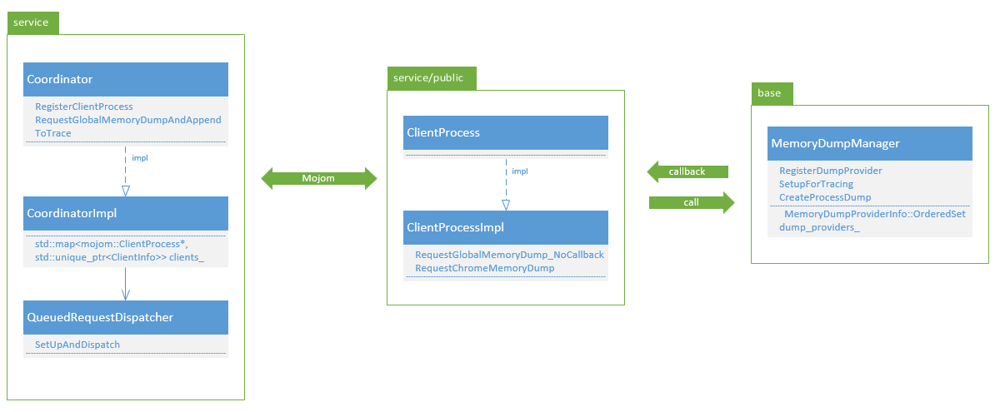
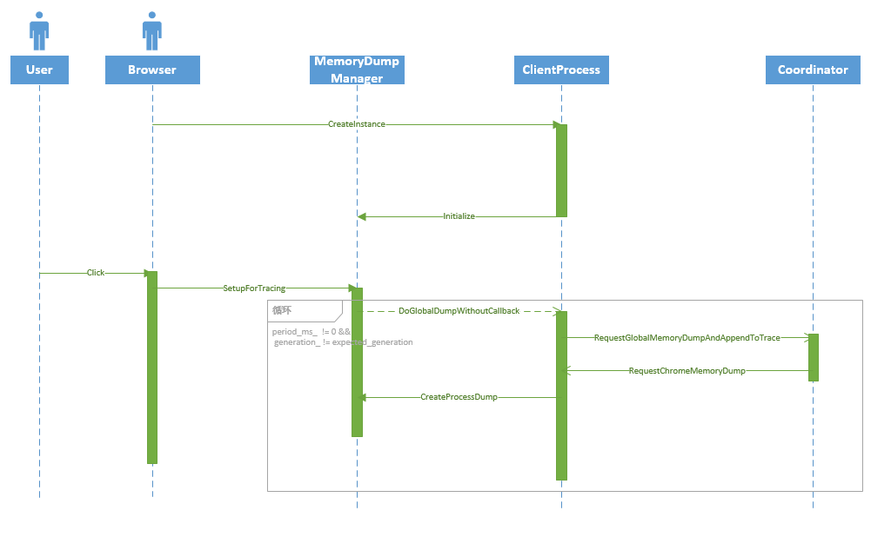

本文档主要解析MemoryInfra如何运行，对其实现和架构进行简单分析，并不深入某些细节（因为细节太多...）。MemoryInfra作为Chromium Tracing框架的一个组成部分，意味着其触发和数据可视化由Tracing完成，与Tracing相关的这里不作详细说明。

阅读本文档前，请确保你已经知道如何往自己的组件中[添加MemoryInfra Tracing][add-memoryinfra]。我强烈建议我们自己添加的类，只要你觉得有一定内存负载，如实例了很多对象或使用容器或数组对某些对象进行管理，就应该将其纳入memroyinfra的监控范围内，这样对我们后面对内存性能问题的分析有很大帮助，其实你要做的只是将`base::trace_event::MemoryDumpProvider`作为父类，然后实现其`OnMemoryDump`接口，并在构造函数中对其进行注册，就这么简单。

[add-memoryinfra]: https://kb.cvte.com/pages/viewpage.action?pageId=120667449

[TOC]

## 总览

从谷爷（google）的图里，我们可以Memory Profiling的架构有个大体的了解。我们客制化的`MemoryDumpProvider`类似于`MemoryDumpManager`的细胞，用于在特定线程上完成具体工作，而`MemoryDumpManager`运行于特定进程下。当有memory dump请求出现时（左下角的闪电）,会将请求分发到系统的指定进程下，再由`MemoryDumpManager`产生dump，并存入TraceLog中。


### 层次

请思考下，既然每个进程都需要做内存转储的动作，那由谁来通知呢，又由谁来接收。考虑具体情况，首先请求信息被交给Browser进程下的MemeoryDumpManager，接下来呢，他要将信息“广播”出来，这个动作由谁来做，由`MemoryDumpManager`来做吗？可是在这个架构的实现里`MemoryDumpManager`是属于base库的，其不应该依赖于任何上层的东西，而且就算他来做信息转发，那要发给谁，它不知道当前系统里有哪些进程，这些进程中有哪些需要进行内存转储，所以由他来完成这些工作是不现实的。

这时候可以考虑引入一个服务（service）来负责这些信息的发送和接收。实际上，这个服务为`Coordinator`，实现在`coordinator_impl.cc`中。这样进程在初始化的时候将自己注册到`Coordinator`中去，在需要的时候`Coordinator`会将请求逐个通知到进程。引入服务后又出现了一个问题，Chromium的设计要求service不能依赖于base库，怎么解决这个问题呢？。

解决方法是再引入了一个中间层，这里的中间层为`ClientProcess`，实现在`client_process_impl.cc`中。进程初始化的时候，会创建各自的`CLientProcessImpl`对象，在这个对象的构造函数中会初负责初始化`MemoryDumpManager`和将自己注册到`CoordinatorImpl`中，这样当有请求发出时，`CoordinatorImpl`会遍历所有的`ClientProcessImpl`对象，再由后者完成对`MemoryDumpManager`的调用，从而完成内存转储。

总的来讲，三者的关系如下：


`Coordinator`服务运行在Browser进程上，他与CilentProcess通过Mojom进行通信，如果是ClientProcess调用MemroyDumpManager，则通过直接函数调用实现，反过来是通过回调函数的方式，这样就避免了循环依赖。

## 初始化

对于Browser进程来讲，在`browser_main_loop.cc`的`BrowserMainLoop::InitizalizeMojo()`函数中创建ClientProcessImpl，非Browser进程，如GPU和Render等，则在`child_thread_impl.cc`中的`ChildThreadImpl::Init`中创建，创建过程类似：

``` cpp
void BrowserMainLoop::InitializeMojo() {
  ...
  // Registers the browser process as a memory-instrumentation client, so
  // that data for the browser process will be available in memory dumps.
  service_manager::Connector* connector =
      content::ServiceManagerConnection::GetForProcess()->GetConnector();
  memory_instrumentation::ClientProcessImpl::Config config(
      connector, resource_coordinator::mojom::kServiceName,
      memory_instrumentation::mojom::ProcessType::BROWSER);
  memory_instrumentation::ClientProcessImpl::CreateInstance(config);
  ...
}
```

接下来，ClientProcessImpl的构造函数中，完成对Coordinator服务的注册和对MemroyDumpManger的初始化,后者主要将自己的函数做为参数传入`MemoryDumpManager::Initialize`函数中。

``` cpp
ClientProcessImpl::ClientProcessImpl(const Config& config)
    : binding_(this), process_type_(config.process_type), task_runner_() {
  ...
    mojom::ClientProcessPtr process;
    binding_.Bind(mojo::MakeRequest(&process));
    coordinator_->RegisterClientProcess(std::move(process),
                                        config.process_type);      
  ...
  bool is_coordinator_process =
      config.process_type == mojom::ProcessType::BROWSER;
  base::trace_event::MemoryDumpManager::GetInstance()->Initialize(
      base::BindRepeating(
          &ClientProcessImpl::RequestGlobalMemoryDump_NoCallback,
          base::Unretained(this)),
      is_coordinator_process);
  ...
}
```
这样就算完成了准备工作了，接下来就等用户触发内存tracing。

## 运行

### TraceLog
当用户[启动MemoryInfra][memory-infra]时，会通过Tracing机制，通知MemoryInfra开始转储内存信息。具体实现为trace_log.cc中的`TraceLog::SetEnabled`函数调用所有观察者的`OnTraceLogEnabled()`接口，而MemoryInfra做为TraceLog的观察者之一，对该函数的实现放在`tracing_observer.cc`，主要功能为通知`memory_dump_manager`启动内存转储。

``` cpp
void TracingObserver::OnTraceLogEnabled() {
  ...
  if (memory_dump_manager_)
    memory_dump_manager_->SetupForTracing(memory_dump_config);
}
```
[memory-infra]: https://kb.cvte.com/pages/viewpage.action?pageId=119563595

### MemoryDumpManager && MemoryDumpScheduler

MemoryDumpManager::SetupForTracing的工作要是调用MemoryDumpScheduler的Start函数，再使用定时器循环调用由`ClientProcessImpl`构造时设置的回调函数。

``` cpp
void MemoryDumpManager::SetupForTracing(
  const TraceConfig::MemoryDumpConfig& memory_dump_config) {
  ...
  // Only coordinator process triggers periodic memory dumps.
  if (is_coordinator_ && !periodic_config.triggers.empty()) {
    MemoryDumpScheduler::GetInstance()->Start(periodic_config,
                                              GetOrCreateBgTaskRunnerLocked());
  }
}

void MemoryDumpScheduler::Start(
    MemoryDumpScheduler::Config config,
    scoped_refptr<SequencedTaskRunner> task_runner) {
  DCHECK(!task_runner_);
  task_runner_ = task_runner;
  task_runner->PostTask(FROM_HERE, BindOnce(&MemoryDumpScheduler::StartInternal,
                                            Unretained(this), config));
}
```
在MemoryDumpScheduler::StartInternal会以类似定时器的方式，定时触发运行Tick函数，而Tick函数的功能就是调用回调函数，还记得前面这个回调函数被设置为了`ClientProcessImpl::RequestGlobalMemoryDump_NoCallback`。

``` cpp
void MemoryDumpScheduler::Tick(uint32_t expected_generation) {
  ...
  callback_.Run(level_of_detail);

  SequencedTaskRunnerHandle::Get()->PostDelayedTask(
      FROM_HERE,
      BindOnce(&MemoryDumpScheduler::Tick, Unretained(this),
               expected_generation),
      TimeDelta::FromMilliseconds(period_ms_));
}
```

### Coordinator

ClientProcessImpl::RequestGlobalMemoryDump_NoCallback只是调用了`Coordinator`的`RequestGlobalMemoryDumpAndAppendToTrace`接口。

``` cpp
void ClientProcessImpl::RequestGlobalMemoryDump_NoCallback(
    const base::trace_event::GlobalMemoryDumpRequestArgs& args) {
  if (!task_runner_->RunsTasksInCurrentSequence()) {
    task_runner_->PostTask(
        FROM_HERE,
        base::Bind(&ClientProcessImpl::RequestGlobalMemoryDump_NoCallback,
                   base::Unretained(this), args));
    return;
  }

  coordinator_->RequestGlobalMemoryDumpAndAppendToTrace(
      args,
      mojom::Coordinator::RequestGlobalMemoryDumpAndAppendToTraceCallback());
}
```

`Coordinator`的主要功能是作为逻辑层，通过调用注册进来的回调函数，完成准备和最后的收尾工作，还有一个重要的作用是对请求分发到所有注册进来的client中，后一个功能主要由QueuedRequestDispatcher实现。
``` cpp
void QueuedRequestDispatcher::SetUpAndDispatch(
    QueuedRequest* request,
    const std::vector<ClientInfo>& clients,
    const ChromeCallback& chrome_callback,
    const OsCallback& os_callback) {
  ...
  for (const auto& client_info : clients) {
    mojom::ClientProcess* client = client_info.client;
    request->responses[client].process_id = client_info.pid;
    request->responses[client].process_type = client_info.process_type;

    // Don't request a chrome memory dump at all if the client wants only the
    // processes' vm regions, which are retrieved via RequestOSMemoryDump().
    if (request->wants_chrome_dumps()) {
      request->pending_responses.insert({client, ResponseType::kChromeDump});
      client->RequestChromeMemoryDump(request->args,
                                      base::Bind(chrome_callback, client));
    }

// On most platforms each process can dump data about their own process
// so ask each process to do so Linux is special see below.
#if !defined(OS_LINUX)
    request->pending_responses.insert({client, ResponseType::kOSDump});
    client->RequestOSMemoryDump(request->wants_mmaps(), {base::kNullProcessId},
                                base::Bind(os_callback, client));
#endif  // !defined(OS_LINUX)
  }      
  ...
}
```

可以看到这里通过循环调用了所有client的RequestChromeMemoryDump接口，这些client如前面所说，是在进程初始化时注册进来的。

### ClientProcess

RequestChromeMemoryDump函数主要是调用了MemoryDumpManager::CreateProcessDump接口。
``` cpp
void ClientProcessImpl::RequestChromeMemoryDump(
    const base::trace_event::MemoryDumpRequestArgs& args,
    const RequestChromeMemoryDumpCallback& callback) {
  ...
  base::trace_event::MemoryDumpManager::GetInstance()->CreateProcessDump(
      args, base::Bind(&ClientProcessImpl::OnChromeMemoryDumpDone,
                       base::Unretained(this)));
}
```

CreateProcessDump及其调用的函数主要实现了真正的内存转储工作，具体来讲就是循环调用了所有注册进来的MemoryDumpProvider的OnMemoryDump接口，如果你看过上一篇关于如何为组件添加MemoryInfra的文档，那你应该对MemoryDumpProvider不陌生，我们为自己的组件实现的OnMemoryDump接口，正是在这里被调用的。
``` cpp
void MemoryDumpManager::InvokeOnMemoryDump(
    ProcessMemoryDumpAsyncState* owned_pmd_async_state) {
  ...
      ProcessMemoryDump* pmd = pmd_async_state->process_memory_dump.get();
      ANNOTATE_BENIGN_RACE(&mdpinfo->disabled, "best-effort race detection");
      CHECK(!is_thread_bound ||
            !*(static_cast<volatile bool*>(&mdpinfo->disabled)));
      bool dump_successful =
          mdpinfo->dump_provider->OnMemoryDump(pmd->dump_args(), pmd);
  ...
}
```

最后，他的序列图大致是这样的：
