## 基于SVC标准的 `H.264/AVC` 扩展的基础概念

除了需要支持所有常见类型的可扩展性外，成功的 `SVC` 最重要的设计标准是编码效率和复杂度。由于 `SVC` 是作为 `H.264/AVC` 的扩展而开发的，所以后者所有设计良好的核心编码工具都被继承下来，因此SVC的设计原则之一，是只有在必要时才应增加新的工具，以有效地支持所需的可扩展性类型。

### 时间可适性

当相应的 `access units` 集可以被分割成具有以下属性的时间基础层和一个或多个时间增强层时，比特流也就提供了时间可适性。将时间层由标识符 $T$ 表示，对于基础层来说，该标识符从0开始，并且从一个时空层到下一个时空层增加1。那么对于每一个自然数 $k$，通过删除所有时空层标识符 $T$ 大于 $k$ 的时间层的所有访问单元，得到的比特流，也能形成给定解码器的另一个有效比特流。

对于混合视频编解码器，一般可以通过限制运动补偿预测，使其通过参考图片的时间层小于或等于待预测图片的时间层，来实现时间可扩展性。之前的视频编码标准 `MPEG-1[2]`、`H.262 MPEG-2 Video[3]`、`H.263[4]` 和 `MPEG-4 Visual[5]` 都在一定程度上支持时间可适性。`H.264/AVC[6]` 由于其参考图片存储器(`reference picture memory control`)的控制，为时间扩展性提供了极大的灵活性。它允许对具有任意时间依赖性的图像序列进行编码，而这些序列只受最大可用 `DPB (decoded picture buffer)` 大小的限制。因此，并不需要改变 `H.264/AVC` 的设计以支持合理数量的时空层的时空扩展性。`SVC` 中唯一相关的修改与时间层的信令有关，这将下节描述。

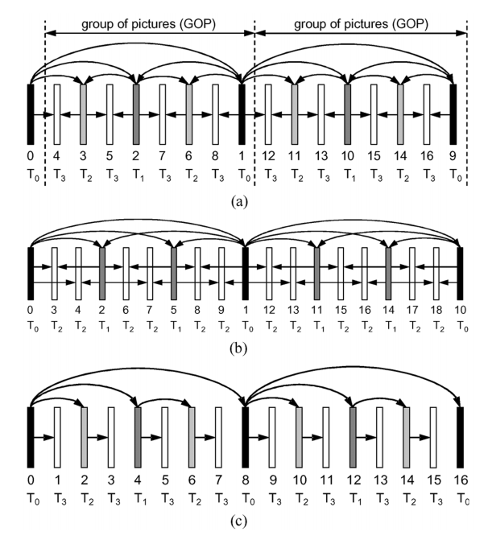

<strong>图1. 层次化预测结构，实现时间上的可扩展性。 (a)分层 `B-picture` 编码。(b)非对偶分层预测结构。(c) 结构编码/解码延迟为零的分层预测结构。图片正下方的数字指定了编码顺序，符号 $T_k$ 指定了时空层，$k$ 代表相应的时空层标识。</strong>

**1 .层次化预测结构**。如图(a)所示，通过分层 `B-picture`[28],[29] 的概念，可以非常有效地提供对偶时间增强层的时间扩展性。增强层图片通常被编码为 `B-pictures`，其中参考图片列表0和1分别限制在时间上的前一图片和后一图片，其时间层标识符小于预测图片的时间层标识符。每一组时间层 ${T_0,...,T_k}$，可以独立于所有时间层标识符 $T > k$ 的层进行解码。在下文中，将时间基础层的两个连续图片之间的图片集，连同后续的基础层图片一起称为一组图片(`GOP`)。

虽然所描述的分层 `B-pictures` 的预测结构提供了时间上的可扩展性，并且也显示出了出色的编码效率（这一点将在后面得到证明)，但它代表了一种特殊情况。一般来说，用于实现时间扩展性的分层预测结构总是可以与 `H.264/AVC` 的多参考图片概念相结合。这意味着，参考图片列表可以通过使用一个以上的参考图片来构建，它们也可以包括与待预测图片具有相同时间层次的图片。此外，层次化的预测结构并不限于对偶情况。作为一个例子，图1(b)示出了一个非对偶式分层预测结构，它提供了2个独立的可解码的，全帧率的1/9和1/3的子序列。还应注意的是，可以任意修改时间基础层的预测结构，例如，为了提高编码效率。所选择的时空预测结构不需要随时间的变化而保持不变。

需要注意的是，可以通过限制运动补偿预测，阻止其根据待预测图片之后的图片进行预测，来任意调整图片编码和解码之间的结构延迟。作为一个例子，图1(c)显示了一个分层预测结构，它不采用来自未来图片的运动补偿预测。 虽然这种结构提供了与图1(a)的预测结构相同程度的时间可扩展性，但与图1(a)的预测结构的7张图片相比，其结构延迟等于零。然而，这种低延时结构通常会降低编码效率。

分层预测结构的编码顺序必须是，参考图片需要在被用于运动补偿预测之前进行编码。这可以通过不同的策略来保证，这些策略大多在相关的解码延迟和内存要求上有所不同。更多分析的细节，可以参考[28],[29]。

分层预测结构的编码效率，很大程度上取决于如何选择不同时间层的图片的量化参数。直观地讲，时间基础层的图片应该以最高的保真度进行编码，因为它们直接或间接地被用作所有时间层图片的运动补偿预测的参考。对于下一个时间层，应该选择一个较大的量化参数，因为这些图片的质量影响着较少的图片。按照这个规则，对于每一个后续的层次结构层，量化参数都应该增加。 此外，最佳的量化参数还取决于实际的信号特征。

更好的量化参数选择可以通过类似于[30]中提出的策略，通过计算昂贵的速率-失真分析来实现。为了避免这种复杂的操作，我们选择了在广泛的测试序列下都被证明是足够稳健的一个策略(参看[31])。基于给定的时空基础层图片的量化参数 $QP_0$，则时空层中标识符 $T > 0$ 的增强层图片的量化参数，可以通过 $QP_T = QP_0 + 3 + T$ 确定。虽然这种在层次上将量化参数级联的策略会导致一组图片内部的峰值 `SNR(PSNR)` 波动比较大，但从主观上看，重建后的视频在时间上显得很平滑，没有让人头疼的时间 "抽水 "伪影。

通常情况下，双向预测块的运动向量是由两个参考列表的独立运动搜索确定的。然而众所周知的是，当在运动搜索过程中考虑组合预测信号(列表0和列表1预测的加权和)时，例如采用[32]中提出的迭代算法，则可以提高 `B-pictures` 的编码效率。

当使用具有2个以上时间层的分层 `B-pictures` 时，还建议采用 `H.264/AVC` 图片间预测设计中的 "空间直接模式（`spatial direct mode`）"[6]，因为如果采用 "时间直接模式（`temporal direct mode`）"，大约有一半的 `B-pictures` 会得出不合适的 "直接运动矢量"。也可以在空间直接模式和时间直接模式之间以画面为单位进行选择。

**2 .层次预测结构的编码效率**。我们现在分析了包括高延迟和低延迟编码下，对偶分层预测结构的编码效率。编码按照联合可扩展视频模型（`Joint Scalable Video Model - JSVM`）算法[31]进行操作，序列采用 `H.264/AVC` 的 `High profile` 编码，选择 `CABAC` 作为熵编码方法，每个列表中的有效参考图片数量设置为1张。

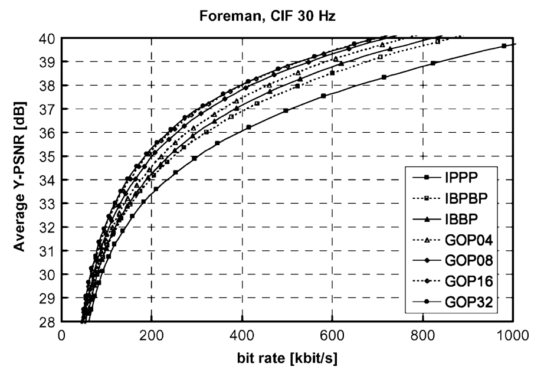

<strong> Fig2. 对比没有延迟约束情况下，传统的 IPPP, IBPBP 和 IBBP 编码结构与分层 `B-pictures` 在编码效率上的差异 </strong>

在第一个实验中，我们分析了在不应用任何延迟约束的情况下分层 `B-pictures` 的编码效率。图2显示了分辨率为CIF(352x288)、帧率为30 Hz的测试视频序列 `"Foreman"` 的代表性结果。通过将 `GOP` 大小放大到 `1s` 左右，可以不断提高编码效率，与广泛使用的 `IBBP` 编码结构相比，在中等比特率的情况下，通过这种方式可以获得超过 `1 dB` 的 `PSNR` 增益。对于 `CIF` 分辨率和帧率为`30 Hz` 的高延迟测试集的序列(见表I)，与 `IPPP` 编码相比，在可接受的视频质量下，使用分层预测结构可以节省 `34 dB` 的比特率，总结在图3(a)中。 对于所有的测试序列，编码效率可以通过增加 `GOP` 大小从而提高编码/解码延迟来提高；GOP大小在8到32张图片之间时可以达到最大的编码效率。

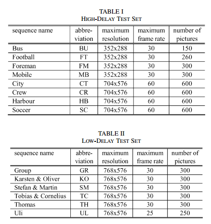

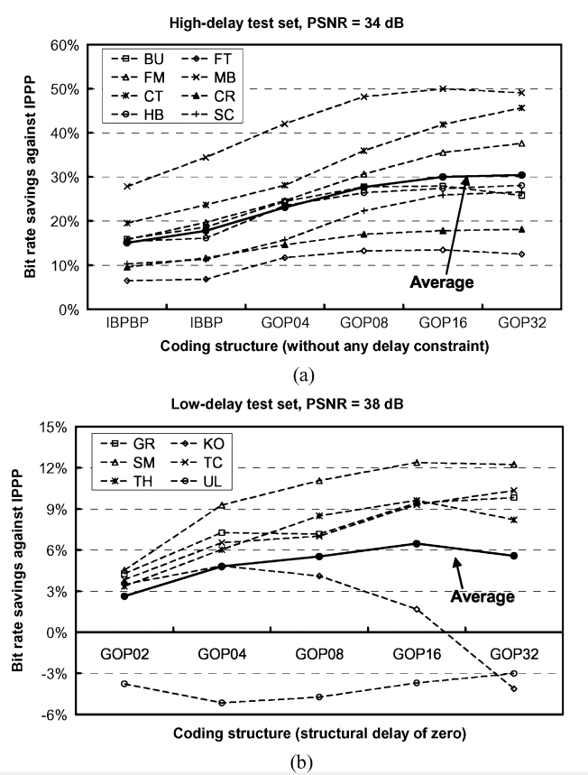

<strong> Fig3. 不同分层预测结构与 IPPP 编码相比，在节省带宽上的表现。(a) 在高延迟测试集上模拟无延迟约束的情况 (b) 在低延迟测试集上模拟结构延迟为0时的情况</strong>

在进一步的实验中，将结构编码/解码延迟约束为等于零，并对低延迟测试集(见表二)，分别为分辨率为 368x288，帧率为 25 Hz 或 30 Hz 的视频会议序列，分析分层预测结构的编码效率。与低延时应用中常用的 `IPPP` 编码相比，在可接受的视频质量为 `38dB` 的情况下，比特率的节省情况如图3(b)所示。与没有任何延迟约束的分层编码相比，编码效率的提高明显较小。然而，对于大多数序列，我们仍然观察到编码效率相对于 `IPPP` 编码的提升。从这些实验中可以推断出，提供时间上的可扩展性通常不会对编码效率产生任何负面影响。当应用需要低延迟时，编码效率可能会有轻微损失。然而，特别是当可以容忍较高的延迟时，使用分层预测结构不仅可以提供时间上的可扩展性，而且可以显著提高编码效率。

### 空间可适性

为了支持空间可扩展编码，`SVC` 遵循传统的多层编码方式，`H.262 MPEG-2` 视频、`H.263` 和 `MPEG-4 Visual` 也采用这种方式。每一层对应于一个支持的空间分辨率，用一个空间层或依赖标识符 $D$ 来表示，基础层的依赖标识符等于0，从一个空间层到下一个空间层，$D$ 增加1。在每个空间层中，与单层编码一样采用运动补偿预测和帧内预测。但为了提高编码效率，与模拟不同的空间分辨率相比，加入了额外的所谓的层间预测机制，如图4所示。

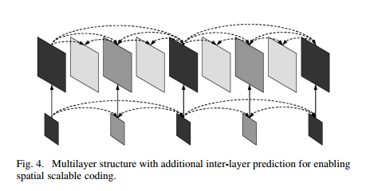

<strong>Fig4. 为了实现空间可适性编码而包含额外层间预测机制的多层结构</strong>

为了限制内存占用和解码器的复杂度，`SVC` 规定所有支持的空间层都使用相同的编码顺序。在给定的时间瞬间，具有不同空间分辨率的图像形成一个访问单元（`access unit`），并且必须按照其对应的空间层标识符的递增顺序连续传输。但如图4所示，下层图片不需要出现在所有的访问单元中，这使得时间和空间的可扩展性相结合成为可能。

**1 .层间预测**：在设计层间预测工具时，主要目标是使尽可能多的下层信息得到利用，以提高增强层的速率-失真（`rate-distortion`）效果。在 `H.262 MPEG-2 Video、H.263` 和 `MPEG-4 Visual` 中，唯一支持的层间预测方法是采用下层信号的重建样本。预测信号是由增强层内部的运动补偿预测、对重建的下层信号进行上采样、或将这种上采样信号与时间预测信号进行平均形成的。

虽然重建的下层样本代表了完整的下层信息，但它们不一定是适合用于层间预测的数据。 通常情况下，层间预测器要与时间预测器竞争，特别是对于运动速度慢、空间细节多的序列，时间预测信号大多比上采样的下层重建更能代表原始信号的近似值。为了提高空间可扩展编码的编码效率，在 `SVC` 中增加了两个额外的层间预测概念[33]：宏块模式及相关运动参数的预测和残差信号的预测。

当忽略空间增强层的微小语法开销时，空间可伸缩编码的编码效率绝对不应该变得比联播（`Simulcast`）差，因为在 `SVC` 中，所有的层间预测机制都是可以切换的。 一个符合 `SVC` 规范的编码器可以根据给定的本地信号特性，自由选择层内和层间预测。层间预测只能在给定的接入单元内部进行，使用一层标识符为 $D$ ，且小于待预测层的空间层标识符的空间层进行预测。用于层间预测的层也称为参考层，它在增强层 `slices` 中的 `slice` 头中被信号化。由于 `SVC` 层间预测的概念包括运动以及残差预测的技术，因此编码器应将所有空间层的时间预测结构对齐。

尽管 `SVC` 被设计为支持具有任意分辨率的空间可伸缩性[34]，[35]，但是为了简单起见，我们将以下关于层间预测技术的描述限于对偶空间可伸缩性的情况，其特征是图片宽度和高度从一层到另一层翻倍。

**a. 层间运动预测**。对于空间增强层，`SVC` 包含一种新的宏块类型，它由一个称为基本模式标志（`base mode flag`）的语法元素触发。这种宏块类型只传输残差信号，而不传输如帧内预测模式或运动参数等额外的信息。当 `base mode flag` 等于1，且参考层中相应的 `8x8` 块位于帧内编码（`inter-coded`）宏块时，该宏块将通过下面会提到的层间帧内预测进行预测。当参考层宏块被帧内编码时，增强层宏块也会被帧内编码。在这种情况下，增强层宏块的分区数据以及相关的参考索引和运动矢量是通过所谓的层间运动预测，从参考层中共置（`co-located`）的 `8x8` 块的相应数据中得出的。

宏块分区是通过对参考层中共置的 `8x8` 块的相应分区进行上采样得到的。当共置 `8x8` 块没有被分割成更小的块时，增强层宏块也不分区。否则，`8x8` 参考层块中的每一个 `MxN` 个子宏块分区对应于增强层宏块中的 `(2M)x(2N)` 个宏块分区。对于上采样宏块分区，使用与共置参考层块相同的参考索引；并且相关运动矢量的两个分量都是通过将相应的参考层运动矢量分量缩放系统 `2` 得到的。

除了这种新的宏块类型外，`SVC` 概念还包括，可以使用参考层中共置的 `8x8` 块的缩放运动矢量，作为常规帧内编码宏块类型的运动矢量预测器。对于在宏块分区水平上传输的每个使用的参考图片列表，即对于每个 `16x16、16x8、8x16` 或 `8x8` 块，有一个标志表示是否使用层间运动矢量预测器。如果该所谓的参考图片列表的运动预测标志等于1，则在增强层中不对宏块分区的相应参考索引进行编码，而是使用共置参考层宏块分区的参考索引进行编码。增强层宏块分区所有块的相应运动矢量预测器，由参考层中共置块的缩放运动矢量形成。运动预测标志等于0时，相应参考图片列表的参考索引在增强层中编码(当参考图片列表中的活动条目数大于1时，由片头语法指定)，相应参考图片列表的运动向量采用 `H.264/AVC` 中规定的常规空间运动向量预测。

**b) 层间残差预测**。层间残差预测可用于所有帧内编码宏块，无论它们是否使用新引入的由 `base mode flag` 触发的 `SVC` 宏块类型编码，还是使用任何传统的宏块类型。在空间增强层的宏块语法中增加了一个标志，它标志着层间残差预测的使用。当该残差预测标志等于1时，参考层中相应的 `8x8` 子宏块的残差信号将使用双线性滤波器进行块状上采样，并作为增强层宏块的残差信号的预测，因此在增强层中只需要对相应的差分信号进行编码。参考层残差的上采样是在变换块的基础上进行的，以保证不跨变换块边界进行滤波，通过滤波可以产生干扰信号分量[36]。图5说明了在 `SVC` 中通过跨块边界滤波和对基于块的滤波残差进行上采样的不同的视觉影响。

<strong>Fig5. 增强层在跨残差块边界进行滤波（左）和忽略跨残差块边界进行滤波（右），两者用于残差预测时的可视化示例。</strong>

**c) 层间帧内预测（intra-layer intra-Prediction）**。当一个增强层宏块的 `base mode flag` 等于1，而其参考层中的共置 8x8 子宏块为帧内编码时，通过层间帧内预测得到增强层宏块的预测信号，并对参考层相应的重建内信号（`reconstructed intra-signal`）进行上采样。为了对色度分量进行上采样，在水平和垂直方向上应用一维 `4-tap FIR` 滤波器。色度分量则使用一个简单的双线性滤波器进行上采样。滤波总是使用相邻的块内（`intra-blocks`）样本，跨越子宏块边界进行。当相邻的块内没有帧内编码时，所需的样本由特定的边界扩展算法生成。这样，就避免了在参考层中重建帧内编码的宏块，这也是为什么提供了所谓的单回路解码[37]、[38]。为了防止干扰预测信号中的信号分量，在上采样之前，`H.264/AVC` 解锁滤波器被应用于参考层的重建内信号。

**2 .通用空间可适性**：与 `H.262 MPEG-2` 视频和 `MPEG-4` 视频类似，`SVC` 支持任意分辨率比的空间可适性编码。唯一的限制是水平和垂直分辨率都不能从一层减少到下一层。`SVC` 设计还包括这样的可能性，即增强层图片只代表其对应的参考层图片的一个选定的矩形区域，该参考层图片以更高或相同的空间分辨率进行编码。另外，增强层图片可以包含超出参考层图片边界的附加部分。这种参考层和增强层的裁剪，也可以是组合的，甚至可以在逐幅图片的基础上进行修改。

此外，`SVC` 的设计还包括用于隔行扫描源的空间可适性编码的工具。对于这两种扩展，即任意分辨率比的通用空间可适性编码和支持裁剪的空间可适性编码，以及隔行扫描源的空间可适性编码，都保留了三个基本的层间预测概念。但特别是运动参数的推导过程，以及针对残差和块内的适当上采样滤波器的设计，还需要进一步的推广。关于这些扩展的详细描述，读者可以参考[34]和[35]。

需要注意的是，在空间适性编码的极端情况下，参考层和增强层可能具有相同的空间分辨率，裁剪可能与宏块边界对齐。作为这种配置的具体特征，由于参考层和增强层中的变换块边界是对齐的，因此省略了用于层间帧内预测的参考层内信号的分块。此外，为了降低解码复杂度，层间帧内预测和残差预测直接在变换系数域中进行。当参考层宏块包含至少一个非零的变换系数时，共置的增强层宏块必须使用与参考层宏块相同的 `luma` 变换大小(4x4或8x8)

**3. 复杂性考虑**：如前所述，采用层间帧内预测的场景性仅限于被选定的增强层宏块，尽管通常可以通过在增强层中允许这种预测模式来提高编码效率，正如最初的设计[33]所做的那样。然而，在[21]和[37]中，已经证明了通过约束层间帧内预测的使用，可以显著降低解码器的复杂性。 这种所谓的约束层间预测背后的想法是为了避免参考层中帧内编码宏块的运动补偿和分块等计算复杂和内存访问密集型操作。因此，层间帧内预测的使用只允许用于增强层宏块，对于这些宏块，共置参考层信号是帧内编码的。此外，还要求所有用于上层的层间预测的层都使用约束性的帧内预测进行编码，这样就可以在不重建任何编码间宏块的情况下构建参考层的帧内编码宏块。

在这些限制条件下(在 `SVC` 中是强制性的)，每个支持的层都可以用一个运动补偿环路进行解码。因此，与单层编码相比，`SVC` 在解码复杂度方面的开销要小于之前的视频编码标准，后者都需要在解码器端进行多个运动补偿环路。此外，值得一提的是，每个质量或空间增强层 `NAL` 单元可以独立于下层 `NAL` 单元进行解析，这为降低解码器实现的复杂性提供了进一步的机会[39]。

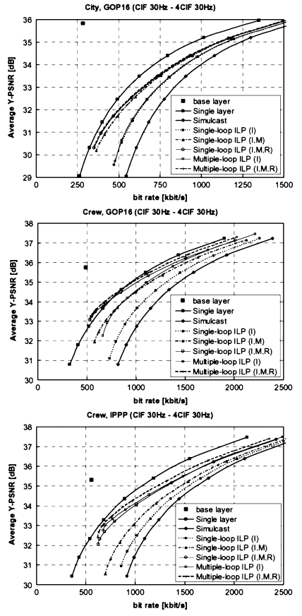

<strong>Fig6.</strong>

**4. 编码效率**：通过与单层编码和联播对比，对空间可扩展编码的 `SVC` 层间预测技术的有效性进行了评估。 为此，基础层以固定的比特率进行编码，而空间增强层的编码，比特率以及启用的层间预测机制的数量是变化的，并额外的模拟了允许无约束的层间帧内预测，用多个运动补偿环路进行解码的场景。只有第一个接入单元是帧内编码， 且`CABAC` 被用作熵编码方法。对16张图片的 `GOP` 大小以及 `IPPPP` 编码进行了仿真，所有的编码器都根据[14]进行了速率-失真优化。 对于每个接入单元，首先对基础层进行编码，然后使用给定相应的编码参数，对增强层进行编码[31]。在操作编码器控制中，层间预测工具被认为是增强层的附加编码选项。按照[31]中的方法生成了较低分辨率的序列。图6描述了空间可扩展性从 `CIF(352x288)` 到 `4CIF(704x576)`、帧率为30 Hz的 "City "和 "Crew "视频序列的仿真结果，对于这两个序列，都提供了 `GOP` 大小为16张图片（提供5个时间层）的结果，而对于 "Crew"，也描述了 `IPPP` 编码（GOP大小为1张图片）的结果。在所有情况下，所有的层间预测（ILP）工具，在给定帧内 `intra（I）`，运动 `motion（M）` 和残差 `residual（R）` 预测后，与联播相比得出编码效率的提高量。然而，一种工具或工具组合的有效性很大程度上取决于序列特征和预测结构。虽然序列 "Crew "和 `GOP` 大小为16张图片的结果与单层编码的结果非常接近，但在我们测试集中表现最差的序列 "City" 上，可以看到一些质量的损失。此外，如 "Crew "所示，当从16张图片的 `GOP` 大小转移到 `IPPP` 编码时，`SVC` 的整体性能比单层编码有所降低。

多环路解码可以进一步提高编码效率，如图6所示。但这种增益往往很小，而且是以显著增加解码器复杂度为代价的。值得注意的是，仅使用层间帧内预测的多环路解码(`"multiple-loop ILP(I)"`)的速率失真性能通常比单环路`"single-loop ILP(I,M,R)"` 情况下的速率失真性能要差，后者对应的是全功能的 `SVC` 设计，而前者在概念上可与 `H.262|MPEG-2 Video`、`H.263` 或 `MPEG-4 Visual` 的可扩展配置文件相媲美。但是，需要注意的是，在之前的这些视频编码标准中，并不支持分层预测结构，这种结构不仅可以提高整体编码效率，而且可以提高层间预测机制的有效性。

**5. 编码器控制**：`JSVM[31]` 中用于多层编码的编码器控制是一个自下而上的过程。对于每个接入单元，首先确定基础层的编码参数，给定这些数据后，按其层标识符的递增顺序对增强层进行编码 。因此，图6中的结果显示只有增强层的损失，而基础层的性能与单层H.264/AVC编码的性能相同。然而，这种编码器控制概念可能会限制可实现的增强层编码效率，因为所选择的基础层编码参数只是针对基础层进行了优化，但它们不一定适合高效的增强层编码。当使用不同的下采样序列作为基础层编码的输入时，可能会观察到类似的效果。 虽然基层的编码器控制可以使每个单独的下采样 "原型" 的重建误差最小化，但获得的不同的基层编码参数可能会使增强层编码的可重用数据变得更多或更烽，尽管重建的基层序列可能具有主观上可比的重建质量。

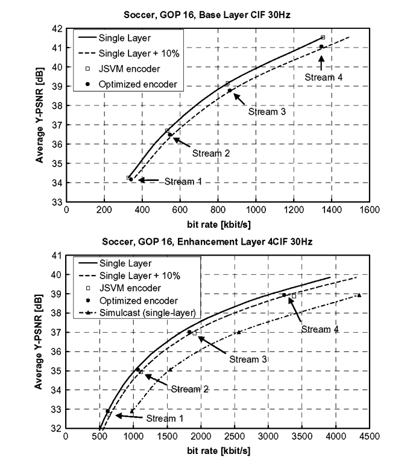

<strong>Fig7. 使用优化的编码器控制，对 "Soccer "视频序列进行空间可扩展编码（从 `CIF` 到 `4CIF`，30Hz）的实验结果。</strong>

在[40]中首次提出了一种改进的多层编码器控制的实验结果，它考虑了基层编码决策对增强层速率失真效率的影响。该算法利用基础层和增强层的拉格朗日成本的加权和来确定基础层编码参数。 通过相应的加权因子，可以对基础层和增强层编码效率进行权衡。在图7中，显示了一个分层 `B-pictures` 和 `GOP` 大小为16张图片的空间可扩展编码的示例结果。用 `JSVM` 和优化后的编码器控制对4个可扩展位流进行了编码。增强层的量化参数 $QP_E$ 被设置为 $QP_B + 4$ ，$QP_B$ 是基础层的量化参数。通过优化的编码器控制，可以控制 `SVC` 编码效率，使基础层和增强层在相同保真度的情况下，相对于单层编码的比特率增量总是小于或等于 `10%`。

### 质量可适性

质量可伸缩性可以被认为是空间可伸缩性的一种特殊情况，基础层和增强层的图片尺寸相同。如前面所述，这种情况得到了空间可伸缩编码的一般概念的支持，它也被称为粗粒度质量可伸缩编码（`coarse-grain quality scalable coding - CGS`），采用了与空间可伸缩编码相同的层间预测机制，但不使用相应的上采样操作和帧内编码参考层宏块的层间分块。此外，层间帧内预测和残差预测直接在变换域进行。当利用层间预测来实现 `SVC` 中的粗粒度质量可扩展性时，通常是通过在增强层中用相对于前一个 `CGS` 层所用的较小的量化步长大小对残差纹理信号进行重新量化来实现纹理信息的细化。

然而，这种用于质量可扩展编码的多层概念只允许在可适应性比特流中支持少数选定的比特率。一般来说，支持的速率点的数量与层数相同。不同 `CGS` 层之间的切换只能在比特流中定义的点上进行。此外，正如在接下来的演示所能看到的那样，当连续的 `CGS` 层之间的相对速率差变小时，用于质量可扩展编码的多层概念就会变得不那么有效。

为了提高比特流适应的灵活性和容错性，同时也为了提高各种比特率下的比特流的编码效率，在 `SVC` 设计中包含了 `CGS` 方法的变体，也被称为中粒度质量可伸缩性（`medium-grain quality scalability - MGS`）。与 `CGS` 概念的不同之处在于修改后的高层信令，它允许在任何接入单元中的不同 `MGS` 层之间进行切换，以及所谓的关键图象（`key picture`）概念，同时它还允许为分层预测结构在质量和增强层编码效率之间的做出适当的权衡。利用 `MGS` 概念，任何增强层 `NAL` 单元都可以从质量可伸缩的比特流中丢弃，从而提供了基于分组的质量可伸缩编码。`SVC` 还提供了将增强层变换系数分布在多个 `slice` 中的可行性。为此，在片头中对变换系数的第一个和最后一个扫描指数进行信号化，`slice` 数据只包括在信号化范围内的扫描指数的变换系数水平。因此，对应于一定量化步长大小的质量细化图象的信息可以分布在对应于不同质量细化层的多个NAL单元上，每个单元只包含特定变换基函数的细化系数(参见[41])。此外，一张图片的宏块(和一个质量细化层)可以像标准的 `H.264/AVC` 那样被分割成若干片。

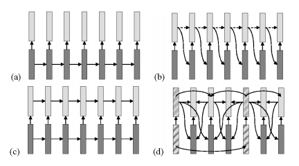

<strong>Fig8. 基于数据包的质量可扩展编码，在增强层编码效率和漂移之间权衡的各种概念。(a)仅基础层控制。(b)仅增强层控制。(c)双环控制。(d)分层预测结构的 `SVC` 中关键图片概念，其中关键图片用阴影框标记。</strong>

**1. 控制质量可扩展编码中的漂移**：基于数据包的质量可扩展编码的运动补偿预测过程必须经过仔细设计，因为它决定了增强层编码效率和漂移之间的权衡(参见[42])。漂移描述了编码器和解码器处的运动补偿预测环路不同步的影响，例如，因为质量细化数据包从比特流中被丢弃。图8说明了为基于数据包的质量可扩展编码，权衡增强层编码效率和漂移的不同概念。

对于 `MPEG-4 Visual` 中的细粒度质量可扩展(`FGS`)编码，漂移在预测结构的选择过程中被完全省略。如图8(a)所示，`MPEG-4 FGS` 中的运动补偿仅以基层重构作为参考，因此任何质量细化包的丢失或修改都不会对运动补偿环路产生任何影响。但这种方法的缺点是，与单层编码相比，大大降低了增强层编码效率。由于只有基层重构信号用于运动补偿预测，因此，用于编码一张图片的 `MPEG-4 FGS` 增强层的那部分比特率，不能被用作以这张图片为参考的后续图片的编码中。

对于 `H.262|MPEG-2` 视频的质量可扩展编码，指定了另一种极端情况下可能的预测结构。在这里，如图8(b)所示，采用具有最高可用质量的参考图片进行运动补偿预测。然而，任何质量细化包的损失都会导致漂移，只能通过内部更新来控制。

作为一种替代方案，可以采用图8(c)所示的具有两个运动补偿环路的概念。这个概念类似于 `H.262|MPEG-2 Video`、`H.263` 和 `MPEG-4 Visual` 中规定的空间可扩展编码。虽然基础层不受增强层中数据包丢失的影响，但任何质量细化数据包的丢失都会导致增强层重建出现漂移。

对于 `SVC` 中的 `MGS` 编码，已经引入了一种使用所谓的关键图片[21]的替代方法。对于每张图片，都会传输一个标志，它标志着参考图片的基本层质量重建，或者增强层重建被用于运动补偿预测。为了限制内存占用，第二个语法元素指示是否对图片的基本质量表示进行额外的重构，并存储在 `DPB` 中。 为了限制这种关键图片的解码开销，`SVC` 规定关键图片的基本层和增强层表示之间的运动参数不能改变，因此对于关键图片，也可以用一个运动补偿循环来进行解码。图8(d)说明了如何将关键图片概念与分层预测结构有效结合。

图8(d)说明了如何有效地结合分层预测结构，所有最粗时间层的图片都作为关键图片传输，只有这些图片的基本质量重建才会插入 `DPB` 中。因此，在最粗时间层的运动补偿回路中不会引入漂移。与此相反，所有的时间细化图片通常都使用具有最高可用质量的参考进行运动补偿预测，这使得这些图片具有较高的编码效率。由于关键图片作为编码器和解码器重建之间的再同步点，漂移传播被有效地限制在较高时间层的相邻图片上。增强层编码效率和漂移之间的权衡可以通过选择 `GOP` 大小或层次级数来调整。 需要指出的是，`H.262|MPEG-2` 视频中的质量可扩展性结构(没有图片作为关键图片编码)和 `MPEG-4|Visual` 中的 `FGS` 编码方式(所有图片都作为关键图片编码)基本上都代表了 `SVC` 关键图片概念的特例

**2. 编码器控制**：如前一节所述，除关键图片外，质量可扩展编码的运动补偿预测总是通过采用相应参考图片的最高可用质量来进行，然而，在 `MGS` 层的编码过程中，并不知道解码器会支持什么。编码器必须决定使用什么参考图片来进行运动估计，同时确定模式决策和要编码的残差信号（运动补偿）。这个决定会影响支持的速率点的编码效率。几项研究[44]、[45]发现，当编码器中的预测环路在最高速率点关闭时，通常可以获得良好的编码效率，即只采用具有最高重建质量的参考用于运动估计、模式决策和运动补偿过程。请注意，这与所谓的开环编码不同，在开环编码中，使用的是参考图片的原件。在[44]和[45]中，还指出可以通过双环编码器控制来提高基底层的编码效率，其中要编码的基底层残差，是由使用基底层作参考图片的第二个运动补偿过程决定的。这些控制通常对增强层编码效率的影响很小，但为了进一步提高增强层编码效率，还可以采用在空间可适性编码中提到的优化编码器控制来对可伸缩编码进行优化。

**3. 比特流提取**：通常存在很多可行的方案, 用于从给定的高质量可扩展比特流中提取一个具有特定平均比特率的子流（使用 `MGS` 方法）。相同平均比特率下可以通过丢弃不同的质量细化 `NAL` 单元来调整画面。因此，所获得的对应于给定目标比特率的平均重建误差可能取决于所使用的提取方法。一个非常简单的方法可能包括随机丢弃 `MGS` 精炼数据包，直到达到要求的比特率。另外，在更复杂的方法中，由编码器向每个编码片 `NAL` 单元分配优先标识符。在比特流提取过程中，起初，优先级最低的编码片 `NAL` 单元被丢弃，当还没有达到目标比特率时，下一个优先级的编码片 `NAL` 单元被丢弃，等等。优先级标识符可以由编码器根据所采用的编码结构确定，也可以由速率失真分析确定。`SVC` 语法提供了不同的方法来在比特流中包含这种优先级信息。关于优化的比特流提取概念(也称为优先级层)的更详细的信息，读者可以参考[46]。

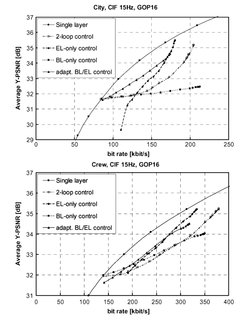

<strong>Fig9. 在 `CIF` 分辨率和15Hz帧率下，比较"City "和 "Crew" 序列在漂移控制概念中，不同权衡下的增强层编码效率和漂移。</strong>

**4. 编码效率**：在第一个实验中，针对 `GOP` 大小为16张图片的分层 `B-pictures`，评估了本部分第一节中讨论的用于控制漂移的不同概念。除了双环路控制外，所有配置都可以通过符合 `SVC` 要求的编码器来实现。序列“City”和“Crew”的结果总结在图9中。对于这些模拟，所有漂移控制概念的中间速率点是通过随机丢弃质量细化 `NAL` 单元获得的。

当像 `MPEG-4 FGS` [对应于图8（a）]那样在基本层关闭运动补偿环路（`Base layer only - BL-only` 控制）时，不会发生漂移，但是增强层编码效率非常低，尤其是对于像“City”这样的视频序列，其运动补偿预测效果很好。

通过在 `H.262|MPEG-2` 视频的质量可缩放模式下完成该循环（`Enhance layer only - EL-only` 控制）[对应于图8（b）]，可以实现很高增强层的编码效率。但是丢弃增强层分组通常会导致严重的漂移，并且重建的视频很快变得不可用。应当注意的是，增强层的控制在很大程度上取决于所采用的编码器控制概念。对于图9中的仿真，编码器控制的操作旨在优化增强层编码效率。虽然可以使用不同的编码器控制，获得具有与单层比特流相同的编码效率的基础层，但是这种编码器控制会大大降低了增强层的编码效率。并且，不管所使用的编码器控制如何，增强层 `NAL` 单元的部分丢失始终会导致明显的漂移。

对于双环路控制[对应于图8（c）]，也可以观察到类似的行为，但不同的是在种方式下，对低码率下的基础层的重建质量比较稳定。对于序列“Crew”而言，相应的影响不太明显，因为宏块的相当一部分是帧内编码的，而差异仅体现在帧内编码上。

具有 `SVC` 关键图片概念[ `adapt. BL / EL` 控制，对应于图8（d）]，其中将最粗糙的时间级别的图片编码为关键图片，结合分层预测结构，可以在整个支持的速率间隔内实现合理的编码效率。图9中的结果还表明，当采用分层预测结构时，`SVC` 只能为具有支持大范围比特率的质量可伸缩编码提供合适的编码效率（即无法指定精确的比特率）。

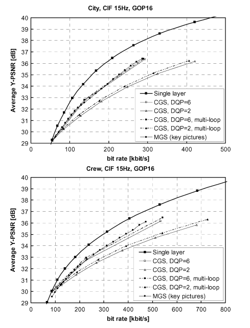

<strong>Fig10. 在CIF分辨率和15Hz帧率下，对 "City "和 "Crew" 序列，使用不同配置的 `CGS` 和 `MGS` 可扩展编码进行比较。 </strong>

在第二个实验中，评估了用于提供质量可伸缩性的不同配置下的效率。在图10中，将针对具有关键图片的 `CGS` 编码和 `MGS` 编码的编码效率,与具有16个图片的 `GOP` 大小的分层 `B-pictures` 的单层编码的编码效率进行了比较。对于质量可伸缩比特流，最低和最高支持速率点之间的比特率间隔对应的 `QP` 差12，即增强层量化步长等于基本层量化步长大小的1/4。通过比较具有不同选择的`Delta QP`（`DQP`）（这是两个连续层的 `QP` 值之间的数值差异）的不同 `CGS` 配置，可以看出编码效率通常随着支持的速率点数量的增加而降低，也就是 `DQP` 会降低。这些图还包含带有多循环解码的 `CGS` 的速率失真曲线，尽管 `SVC` 设计不支持该曲线。如在空间可伸缩编码中也观察到的那样，用于 `CGS` 的多循环解码仅稍微提高了编码效率，因此，这与他对解码器复杂度相对于单循环解码的增加不相符。另外，图10还显示了使用关键图片概念和 `DQP` 为6时更灵活的 `MGS` 编码的编码效率，对于最大速率点时改进的编码效率，和对于最低速率点的降低的编码效率，与 `DQP` 等于6的 `CGS` 编码方式相比，`MGS` 编码是 `VC.2` 中所述的改进的 `MGS` 编码器控制的结果。应该注意的是，与 `CGS` 编码相比，使用 `MGS` 编码时，支持的速率点的数量显着增加。

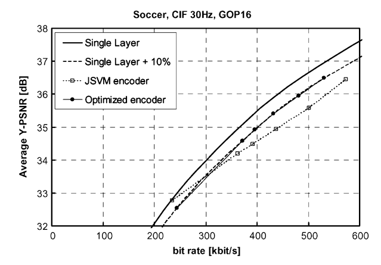

<strong>Fig11. 使用了优化编码控制，在 "Soccer"(CIF 分辨率，30HZ) 视频序列上进行质量可适性编码的实验结果 </strong>

图11展示了如何通过采用在空间可适性中提到的优化编码器控制来提高质量可伸缩编码的编码效率。在此模拟中，使用了 `GOP` 大小为16张图片的分层 `B-pictures`，在不使用关键图片的情况下，通过 `MGS` 编码实现质量的可扩展性。所描绘的速率点是通过连续丢弃 `MGS` 增强层中最大的时间层得到的。可以看出，通过容忍最低速率点的编码效率损失，可以显著提高高速率端的编码效率。通过优化的编码器控制，在整个支持的比特率范围内，与相同保真度的单层编码相比，可以将比特率的提升限制在10%左右。

**5. SVC到H.264/AVC的重写**；`SVC` 设计还支持创建高质量的可扩展比特流，通过使用低复杂度的重写过程[47]，可将其转换为符合不可扩展的 `H.264/AVC profiles` 之一的比特流。对于这种质量可扩展模式，使用了与 `CGS` 或 `MGS` 相同的语法，但对解码过程的两个方面进行了修改。

1. 对于层间帧内预测，预测信号不是由参考层的重建帧内信号形成的，而是通过共置的参考层块，来推断空间帧内预测模式，在目标层，即对一幅图像进行解码的最高质量的细化层中，进行像单层H.264/AVC编码那样的空间帧内预测。此外，残差信号的预测与运动补偿宏块类型一样。

2. 帧内编码宏块和层间帧内编码宏块(`base mode flag` 等于1，且共置参考层块为帧内编码)的残差预测是在变换系数级域中进行的，也就是说不是对变换系数进行缩放，而是对变换系数的量化级进行缩放和累加。

这两项修改确保了这种高质量的可扩展比特流可以转换为不可扩展的 `H.264/AVC` 比特流，以产生与高质量的可扩展 `SVC` 比特流完全相同的解码结果。这种转换可以通过一个重写过程来实现，其复杂程度明显低于对 `SVC` 比特流的进行重编码。修改后的解码过程在层间预测方面的使用，是由增强层片头中的标志来表示的。

## SVG 高层设计

在 `H.264/AVC` 的 `SVC` 扩展中，结合了前面描述的时间，空间和质量可伸缩性的基本概念。为了实现简单的比特流适配，`SVC` 还提供了一个可以轻松识别完整可伸缩比特流中包含的子流的手段。`SVC` 比特流不需要提供所有类型的可伸缩性。由于相对于单层编码，对质量和空间可伸缩性的支持通常伴随着编码效率的降低，因此可以根据应用程序的需求来调整编码效率和所提供的可伸缩性程度之间的权衡。对于单层编码的空间和质量可伸缩性的进一步比较，请参阅[48]。

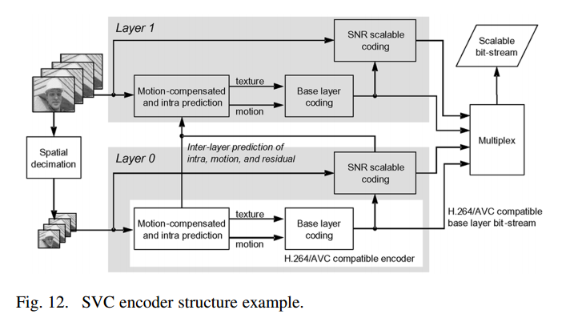

### A. 联合可适性

图12说明一个结合了空间、质量和时间可扩展性的一般性概念，它显示了一个具有两个空间层的编码器结构示例。`SVC` 编码结构是以依赖层组织的，一个依赖层通常代表一个特定的空间分辨率。在极端情况下，也有可能两个依赖层的空间分辨率是相同的，在这种情况下，不同的层在质量上提供了粗粒度的可扩展性（`CGS`）。依赖层由一个依赖标识符来标识。空间分辨率从一个层到下一个层不得减少。对于每个依赖层，与单层编码一样，采用了运动补偿预测和帧内预测的基本概念；依赖层之间的冗余利用了额外的层间预测概念，如在空间可适性概念中所解释的那样。

每个依赖层内的质量细化层由一个质量标识符标识 $Q$ 表示。然而，当一个空间增强层（依赖层）的参考层包含不同的质量表示时（`quality representations`），需要标志出其中哪一个质量表示被用于层间预测。因此，`SVC` 片包括一个语法元素，它不仅可以指示是否采用层间预测，还可以指示相应参考层的依赖标识符 $D$ 和质量标识符 $Q$。对于具有质量标识符的质量细化层 $Q>0$，总是采用前一个具有质量标识符 $Q-1$ 的质量层进行层间预测。为了限制存储中间表示的内存占用，依赖层在特定瞬间的所有切片都必须使用相同的标识为 $D$ 的基础表示（`base representation`），并使用 $Q$ 用于层间预测。

依赖层和质量细化概念之间的一个重要区别是，不同的依赖层之间的切换只设想在定义的切换点上进行。然而，在任何接入单元中，不同质量细化层之间的切换几乎是可能的。质量细化可以作为新的依赖层(不同的 $D$)或作为依赖层内的附加质量细化层(不同的 $Q$)来传输。这不会改变基本的解码过程，只有高层信令和错误检测能力受到影响。当质量细化被编码在依赖层内(相同的 $D$，不同的 $Q$ )时，解码器无法检测质量细化包是否丢失或被故意丢弃。这种配置主要适用于与分层预测结构和关键图片一起使用，以实现高效的基于数据包的质量可扩展编码。

在 `SVC` 中，一个时间瞬间的所有分片数据 `NAL` 单元与零个或多个非 `VLC NAL` 单元一起构成一个访问单元。 由于层间预测只能在一个接入单元内部由低层向高层进行，因此空间和质量扩展性可以很容易地与时间扩展性相结合。对一个访问单元的所有切片都分配了相同的时间层次。

除了主要的可扩展性类型--时间、空间和质量可扩展性外，`SVC` 还支持 ` region-of-interest - ROI` 可扩展性，其可以通过片组的概念来实现，但 `ROI` 的形式仅限于可以表示为宏块集合的模式。

### B. 系统接口

`SVC` 标准的一个重要目标是支持简单的比特流操作。为了提取一个时空分辨率和/或比特率降低的子流，应该从比特流中删除所有不需要解码目标分辨率和/或比特率的 `NAL` 单元。为此，需要知道每个编码片 `NAL` 单元的依赖性标识符 $D$、质量标识符 $Q$ 和时间标识符 $T$ 等参数。此外，还需要知道上层的层间预测需要哪些 `NAL` 单元。

为了帮助方便地进行比特流操作，`H.264/AVC` 的1字节头为 `SVC NAL` 单元类型额外扩展了3个字节。这个扩展头包括标识符 $D$, $Q$ 和 $T$，以及协助比特流适应的附加信息。其中一个额外的语法元素是一个优先级标识符 $P$，它标志着一个 `NAL` 单元的重要性，它既可以用于每个 `NAL` 单元的单次比较的简单比特流适配，也可以用于使用优先层信息的速率-失真优化比特流提取。

每个 `SVC` 比特流包括一个子流，它符合 `H.264/AVC` 的不可扩展配置。标准 `H.264/AVC NAL` 单元(非 `SVC NAL` 单元)不包括扩展的 `SVC NAL` 单元头。然而，这些数据不仅对码流适配有用，而且其中一些数据也是 `SVC` 解码过程中所需要的。为了将这些 `SVC` 相关信息附加到非 `SVC NAL` 单元上，引入了所谓的前缀 `NAL` 单元。这些 `NAL` 单元直接在 `SVC` 位流中所有非 `SVC VCL NAL` 单元之前，并包含 `SVC NAL` 单元头扩展。

`SVC` 还指定了额外的 `SEI` 消息，例如，这些消息包含 `SVC` 比特流中所包含的层的空间分辨率或比特率等信息，可以进一步帮助比特流适应过程。关于 `SVC` 的系统接口的更多详细信息，请参见[49]。 关于 `SVC` 的 `RTP` 有效载荷格式和 `SVC` 文件格式的信息分别在[50]和[51]中给出。

### C. 码流切换

如上所述，在每个接入单元中，依赖层内不同质量细化层之间的切换是可能的。但是，不同依赖层之间的切换只有在 `IDR` 接入单元才有可能。在 `SVC` 环境下，一个接入单元是否为 `IDR` 接入单元，一般取决于目标层。一个依赖层的 `IDR` 接入单元，标志着当前和所有后续接入单元的层的重建，是独立于所有先前传输的接入单元的。因此，在当前访问单元为 `IDR`时，总是可以切换依赖层(或开始对依赖层进行解码)，但并不要求此时必须启动任何其他依赖层的解码。`IDR` 接入单元只为特定的依赖层提供随机接入点。例如，当一个接入单元代表一个增强层的 `IDR` 接入单元，因而不能使用运动补偿预测时，仍然可以在下层采用运动补偿预测，以提高其编码效率。

虽然 `SVC` 规定了不同依赖层之间的切换只针对定义好的点，但解码器的实现方式却是至少可以在几乎任何接入单元中实现下层切换。一种方式是进行多环解码。也就是说，当解码增强层时，参考层的图象被重建并存储在附加的 `DPB` 中，尽管它们不是解码增强层图象所需要的。但是，当传输切换到任意接入单元中的任何一个下级层时，由于已经操作了一个附加的 `DPB` ，所以可以继续对该层进行解码，就像对以前的所有接入单元都会对相应层进行解码一样。这样的解码器实现需要额外的处理能力。对于上切换，解码器通常要等待下一个 `IDR` 接入单元。 然而，与单层编码中的随机存取类似，解码器也可以通过采用合适的错误隐藏技术，立即开始对所有到达的 `NAL` 单元进行解码，并推迟增强层图片的输出(即继续输出下层重建)，直到增强层的重建质量稳定下来(渐进式解码器刷新)。

### D. Profiles

`Profiles` 和 `levels` 规定了一致性点，以促进具有类似功能要求的应用程序之间的互操作性。`Profiles` 定义了一组可用于生成比特流的编码工具，而 `levels` 则指定了比特流的某些关键参数的限制。所有符合特定 `Profiles` 的解码器必须支持所有包含的编码工具。

`H.264/AVC` 的 `SVC` 修正案为 `SVC` 指定了三种 `profiles`[10]：`Scalable Baseline, Scalable Hight, Scalable High Intra`。`Scalable Baseline` 主要针对需要低解码复杂度的对话和监控应用，在这个`profile`中，对空间可扩展编码的支持仅限于水平和垂直方向上，连续空间层之间的分辨率比为1.5和2，以及宏块对齐裁剪。此外，此 `profile` 中不包括交错源的编码工具。对于为广播、流媒体和存储应用而设计的 `Scalable High profile`而言，这些限制被取消，并且支持任意分辨率比和裁剪参数的空间可扩展编码。`Scalable Baseline` 和 `Scalable High profile` 都支持质量和时间上的可扩展编码，没有任何限制。符合`Scalable Baseline` 和 `Scalable High profile` 的比特流包含一个基础层比特流，分别符合 `H.264/AVC` 的限制性 `Baseline profile` 和 `High profile`[6]。需要注意的是，`Scalable Baseline profile` 支持 `B-slice`、加权预测、`CABAC` 熵编码和增强层中的 `8x8 luma` 变换( `CABAC` 和8x8变换只支持某些级别)，不过基础层必须符合限制性 `Baseline profile`，它不支持这些工具。

主要为专业应用而设计的 `Scalable High Intra-profile` 的比特流只包含 `IDR` 图片（适用于所有层）。除此之外，还支持与 `Scalable High profile` 相同的编码工具集

## 结论

与之前视频编码标准的可扩展 `profiles` 相比，`SVC` 的 `H.264/AVC` 扩展提供了各种工具，以减少相对于单层编码的编码效率损失，最重要的区别如下：

* 可以采用分层预测结构，以提供多层的时间扩展性，同时提高编码效率，增加质量和空间可扩展编码的有效性。

* 新的运动和残差的层间预测方法，提高了空间可伸缩和质量可伸缩编码的编码效率。

* 分层预测结构下关键图片的概念，有效控制了基于包的质量可伸缩编码的飘移。

* 用于空间和质量可伸缩编码的单运动补偿环路解码，提供接近单层编码的解码器复杂度。

* 支持修改后的解码过程，允许无损和低复杂度地将质量可扩展的比特流改写成符合非可扩展的 `H.264/AVC profiles` 的比特流。

这些新特性为 `SVC` 提供了相当有竞争力的速率-失真性能，同时只需要在解码器端进行单一的运动补偿回路。我们的实验进一步说明了以下几点。

* 时间上的可扩展性：通常可以在不损失速率-失真性能的情况下实现。

* 空间可扩展性：当应用优化的 `SVC` 编码器控制时，在相同保真度下，相对于不可扩展的 `H.264/AVC` 编码，对偶空间可扩展性的比特率增加可以低至10%。需要注意的是，随着两层空间分辨率的降低，结果通常会变差，而随着空间分辨率的提高，结果会有所改善（译者注：这个在实验里没看出来？）。

* `signal-to-noise ratio - SNR` 可扩展性：当应用优化的编码器控制时，在相同保真度下，相对于不可扩展的`H.264/AVC` 编码，当跨越比特率范围时，所有支持的速率点的比特率增加可以低至10%，最低和最高支持的速率点之间的系数为2-3。

翻译自：[Overview of the Scalable Video Coding Extension of the H.264/AVC Standard](http://ip.hhi.de/imagecom_G1/savce/downloads/SVC-Overview.pdf)