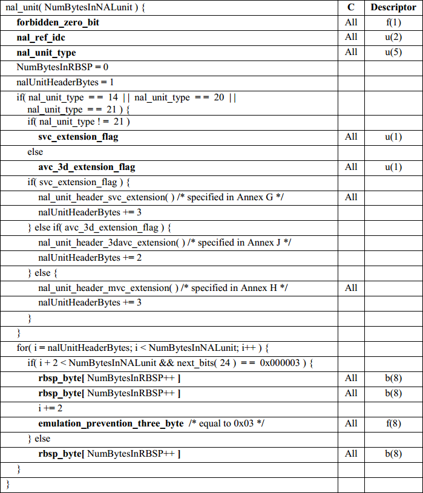
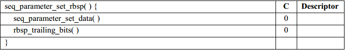

## 前言

本文主要基于对FFMpeg源码和H264 SPEC的研究，尝试对 `SPS` 的解码过程进行总结，这是系列的第一篇文章，所以会对简单说明下解码前的一些流程，希望对以后想了解 `H264` 编解码这部分的同学有点帮助。

## `SPS`简介

`SPS` 全称为 `Sequence Paramater Set` ，又称作序列参数集。在 `H.265` 标准协议中规定了多种不同的 `NAL Unit` 类型，其中类型 `7` ，也就是`nal_unit_type`为 `7` 时，表示该 `NAL Unit` 内保存的数据为 `Sequence Paramater Set` 。`SPS` 中保存了一组编码视频序列(Coded video sequence)的全局参数。所谓的编码视频序列即原始视频的一帧一帧的像素数据经过编码之后的结构组成的序列。而每一帧的编码后数据所依赖的参数保存于图像参数集中，序列参数集中包含了一些如 `profile`，`level`，`MaxFrameNum` 等的重要信息。

在 `SPEC` 中的定义：

> `sequence parameter set`: A syntax structure containing syntax elements that apply to zero or more entire coded video sequences as determined by the content of a seq_parameter_set_id syntax element found in the picture parameter set referred to by the pic_parameter_set_id syntax element found in each slice header. 

一般情况 `SPS` 和 `PPS` 的 `NAL Unit` 位于整个码流的起始位置。但在某些特殊情况下，在码流中间也可能出现这两种结构，主要原因可能为：

* 解码器需要在码流中间开始解码；
* 编码器在编码的过程中改变了码流的参数（如图像分辨率等）； 

## 解析

解析数据包时，程序通过判断 `0x000001` 或 `0x00000001` 找到新一帧的帧头，从而得到完整的一帧的数据，这部分的逻辑在`h264_parser.c` 的 `parser_parse` 函数中完成，主要步骤包括先从 `h264_find_frame_end` 找到新一帧的帧头，然后通过 `ff_combine_frame` 将数据包拼装成一个完整的 `NAL`单元。

接着，在 `parse_nal_units` 中对 `NALU` 进行解析，并开始解码一些基本的信息，如对`SPS`，`PPS`，`SEI` 等进行解码，从解析的结果中能拿到 `nal_unit_type` 等重要的信息，解析前需要注意对三位防竞争码进行剔除。

`NALU` 的语法表在SPEC中的 `7.3.1` 章节：



当判断到 `nal_unit_type` 为 `H264_NAL_SPS` 时，就可以通过 `ff_h264_decode_seq_parameter_set` 对 `SPS` 进行解码。

其他的几个重要字段的含义如下:

* `nal_ref_idc` 指示当前 NAL 的优先级。取值范围为 0-3, ,值越高,表示当前 NAL 越重要,需要优先受到保护，而且规定，如果当前NAL属于参考帧的片，或是`SPS`，`PPS`这些重要的数据单位时，本元素必须大于0。

* nal_unit_type 指明当前 `NAL unit` 的类型，其中几个和重要的有 `SEI` 为 `6`，`SPS` 为 `7`，`PPS`为 `8`。

* emulation_prevention_three_byte NAL 内部为防止与起始码竞争而引入的填充字节 ,值为 0x03。

通常情况下， `SPS` 很小，我看了两个录屏码流的 `SPS`，都没超过32个字节，对其的解码也没有想象中的复杂，主要就是从数据中以类似结构体的方式逐个将参数读出，可能的难点是，其对部分数据采用了 `Exp-Golomb` 熵编码的方式进行了压缩，也就是 `Descriptor` 为 `ue` 的部分参数。

`SPS` 的语法表在SPEC中的 `7.3.2.1` 章节中:




...

这里只截取了部分的语法元素，我们已经能看到 `profile_idc` 和 `level_idc` 这两个对视频编解码有重要意义的参数了，代码上的处理也趋于简单，如对 `level_idc` 和 `seq_parameter_set_id` 的获取，这里的 `gb` 变量用于存储整个字节流：

``` C
    level_idc = get_bits(gb, 8);
    sps_id    = get_ue_golomb_31(gb)
```

这里面的一些重要的元素有：

* `profile_idc` 和 `level_idc` 指明所用 profile、 level，H264有多个版本，版本越高编码效率和压缩率就越高，对应的版本是`profile`，在给定的 `profile` 下，`level` 通常与解码器的处理能力和内存容量相对应，每一个档次对应不同的参数，如取样速率、图像尺寸、编码比特率等。

* `constraint_set0_flag` 到 `constraint_set5_flag` 指定需要遵从哪些制约条件，如当 `constraint_set0_flag` 为1时表示必须遵从附录 `A.2.1` 所指明的所有制约条件，为0时表示不必遵从所有条件，以此类推。

* `log2_max_frame_num_minus4`：从该值可以算出最大帧编号，计算方法为：MaxFrameNum=2^(log2_max_frame_num_minus4+4)，该值的范围是[0,12]。

* `pic_order_cnt_type ` 指明了图像顺序号 (POC, picture order count) 的编码方法， POC的作用是标识图像的播放顺序，同时还用于在对帧间预测片解码时，标记参考图像的初始图像序号。

* `pic_width_in_mbs_minus1` 表示图像的宽占多少宏块大小，通过这个参数可以算出图像的宽是多少。

如果存在 `VUI` 的话，还会对 `VUI` 进行解析。`VUI` 表示视频可用性信息 `Video usability information`，可以在 `Annex E`里看到语法表，在解码过程中，对于重建亮度和色度像素来说，VUI参数不是必要的，符合本标准的解码器不需要去处理这些VUI信息，也照样可以得到与本标准中相符的输出顺序，一些VUI参数会被用于检查比特流的相符性和解码器输出时序的相符性。

除了 `Sequence Paramater Set` 外，`SPEC`中还定义了序列参数集扩展（`Sequence Parameter Set Extension`） 和 序列参数集子集（`Subset sequence parameter set`） 作为 `SPS` 的扩展和子集，在 `FFMPEG` 中没看到这两种NALU进行处理的逻辑。

对序列参数集扩展的解码支持并不在标准的规定内:

> The decoding of the sequence parameter set extension and the decoding of auxiliary coded pictures is not required for conformance with this Recommendation | International Standard.

序列参数集扩展中定义了对 `AUX` 的支持，当语法中的`aux_format_idc`为0时，表示在编码序列中不包含辅助性的编码图像。当存在 `Sequence Parameter Set Extension NAL`单元时，它应该在是 `Sequence Parameter Set NAL`单元之后的下一个NAL单元，且这两个相邻的 `NALU` 具有相同的 `seq_parameter_set_id` 值，从其语法结构来看，主要对 `alpah` 通道有影响。

序列参数集子集用于提供对 `SVC`，`MVC`，`MVCD` 和 `3D-AVC` 的支持。