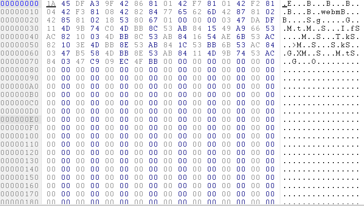
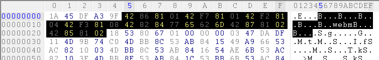
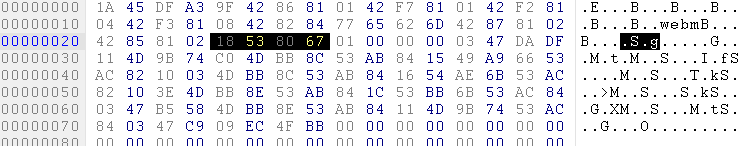
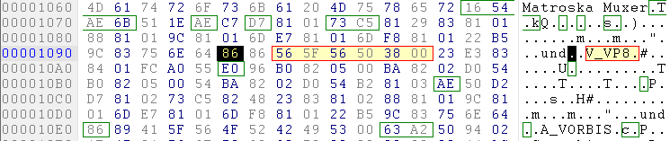
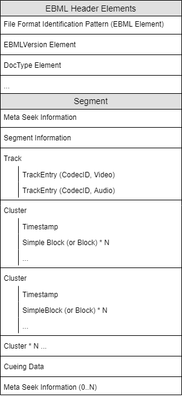

# WebM简介

## 背景

WebM是Google发起的，由WebM开源项目推广的一种数字多媒体容器文件格式，是Matroska多媒体容器格式的子集。它的目标主要有三个：
* 为VP8/VP9和开放的web环境提供一种容器格式
* 使web能够更简单的提供和使用VP8/VP9视频
* 最终极的目标是促进开放格式的普及，使任何地区，任何用户都可以轻松的享受视频带来的快乐。

## 编码格式支持

Video Codec Name: VP8 or VP9
Audio COdec Name: Vorbis or Opus

# WebM分析

## 工具：

* Hex Workshop 或者其他16进制编辑器
* 计算器
* WebM demo视频：在网上下载的一个.webm文件

## 总体框架

## 分析

### EBML

为了分析WebM格式，首先了解下EBML(Extensible Binary Meta Language)，它是一种通用的文件格式，旨在成为XML的二进制等价物，它提供了一个将数据存储在类似XML标签中的基础框架，最初就是为Matroska音视频容器格式开发的，WebM中也使用了这种格式。

和XML一样，EBML可以任意使用已经实现的特定标签，如Signed Integer， Unsigned Interger等，而且都是以大端的字节顺序方式进行存储。同时，还使用Elements系统来构成EBML的文档。每一个Element都包含元素的ID，元素大小的描述符和二进制本身，Elemnts也可以嵌套包含较低级别的元素。

### Matroska

在Matroska中，Elements的构成类似：

Element ID + DataSize + Data

其中对Element ID 的定义使用了变长字节：

bits, big-endian

1xxx xxxx                                  - Class A IDs (2^7 -1 possible values) (base 0x8X)

01xx xxxx  xxxx xxxx                       - Class B IDs (2^14-1 possible values) (base 0x4X 0xXX)

001x xxxx  xxxx xxxx  xxxx xxxx            - Class C IDs (2^21-1 possible values) (base 0x2X 0xXX 0xXX)

0001 xxxx  xxxx xxxx  xxxx xxxx  xxxx xxxx - Class D IDs (2^28-1 possible values) (base 0x1X 0xXX 0xXX 0xXX)

对DataSize的定义也类似：

bits, big-endian

1xxx xxxx                                                                              - value 0 to  2^7-2

01xx xxxx  xxxx xxxx                                                                   - value 0 to 2^14-2

001x xxxx  xxxx xxxx  xxxx xxxx                                                        - value 0 to 2^21-2

0001 xxxx  xxxx xxxx  xxxx xxxx  xxxx xxxx                                             - value 0 to 2^28-2

0000 1xxx  xxxx xxxx  xxxx xxxx  xxxx xxxx  xxxx xxxx                                  - value 0 to 2^35-2

0000 01xx  xxxx xxxx  xxxx xxxx  xxxx xxxx  xxxx xxxx  xxxx xxxx                       - value 0 to 2^42-2

0000 001x  xxxx xxxx  xxxx xxxx  xxxx xxxx  xxxx xxxx  xxxx xxxx  xxxx xxxx            - value 0 to 2^49-2

0000 0001  xxxx xxxx  xxxx xxxx  xxxx xxxx  xxxx xxxx  xxxx xxxx  xxxx xxxx  xxxx xxxx - value 0 to 2^56-2

看起来其实就是霍夫曼编码，通过这种方式可以实现对数据的无损压缩。

而Data就只是二进制数据本身。

### WebM 组成

#### EBML Header Elements
要怎么分析这些16进制数据呢？首先看到前面的四个字节，固定为`0x1A45DFA3`，为EBML Elemnt，在[EBML Spec](https://tools.ietf.org/html/draft-ietf-cellar-ebml-07#section-13.2)中有做规定，其后面跟着这个EBML Elemnt的长度，这个长度是以`0x9F`开头，但这个长度占多少字符呢，我们要看这个16进制数据转化为二进制后的结果，`0x9F`的二进制表示为`1001 1111`，对比上面对DataSize的定义可知，其对应的是：

1xxx xxxx                                                                              - value 0 to  2^7-2

这种格式，也就是一个字节的长度。知道了其占一个字节，也就是8个比特位后， 我们要算出其代表的数字是多少。首先第一个比特位是用于匹配Element长度占用的字符数的，所以将其去掉，剩下`0001 1111`，也就是16进制的`0x1F`，所以他代表这个Element的长度就是为`0x1F`字节，我们从`0x9F`这个DataSize字节后开始计算，后面的`0x1F`个字节就是其内容：

接着分析内容中包含了什么？它以`0x4287`开头，查了[EBML Spec]后知道，其代表`EBMLVersion Element`，其长度呢？还是按上面的做法，先从`0x81`开始看起，其二进制格式为`0x1000 0001`，对应于DataSize的第一条规则，也就是8位，一个字节的长度，所以将`0x81`的二进制表示中，去除第一个比特位后，得到十六进制的`0x01`，所以其长度只一个字节，其内容也就是根在DataSize后面的`0x01`，以同样的方式可以计算出后面所有的Element的长度和内容的关系。

#### Segment
在分析完`EBML Header Elements`，我们接着看下面的内容，16进制内容为`0x18538067`，从[Matroska Spec](https://www.matroska.org/technical/specs/index.html)中查到，其代表`Segment Element`，其长度以`0x01`开头，同样对照上面的DataSize表，发现其对应最长的那么行，也就是长度占了8个字节，所以其完整的长度表示为`0x010000000347DADF`，将其转化为二进制，并去掉前面用于匹配长度部分的字节后，得到`0x000000000347DADF`，刚好就是从当前位置一直到文件结尾的位置，所以`Segment Element`包含了整个文件剩下的内容。

对Segment中嵌套的的元素进行分析，可以得到剩下的`Meta Seek Information`，`Segment Information`，`Cluster`，`Track`等重要的Elements

#### Track

我们这里分析的最后一个模块是Track模块，因为其中包含了编码和解码相关的一些重要信息。我们对其CodecID进行分析，首先，定位其位于`offset 0x00001095`的位置，其Elements ID为`0x86`，查Spec后得到其代表的ElementID 为CodecID，接着其长度，以`0x86`开头，二进制表示为`1000 0110`，去掉占位匹配用的`1xxx`比特后，剩下`000 0110`比特，十六进制表示为`0x6`，所以这个ID内容占了6字节，我们取出后面的六字节，发现其内容代表的ASCII码为`V_VP8`，所以表示当前Track的编码方式为`vp8`。

同样的方法可以分析出Audio的编码方式为`A_VORBIS`。

#### 总体

其他部分的分析都是一样的，我这里给出分析后的文件架构图：

# 结论

分析的难点主要在于协议是二进制协议，没有明显的字符串可以用于确认标识，需要不断通过16进制和二进制的转换来获取到正确的`Element ID`和`DataSize`。建议有兴趣的同学自己动手分析下，还是很有意思的，对以后设计出高质量的二进制传输协议也有一定的帮助。