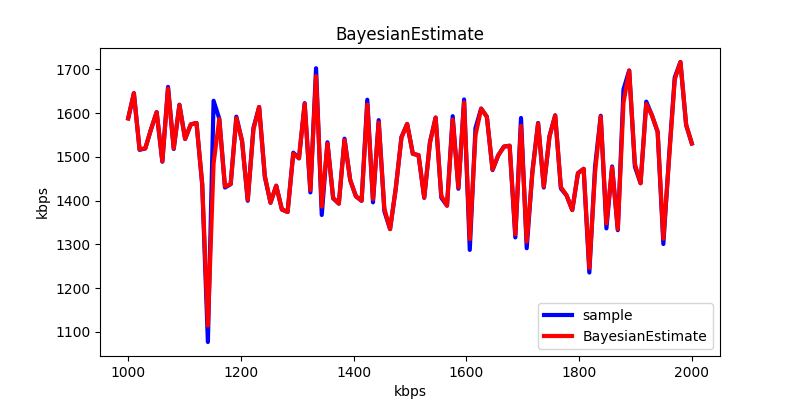
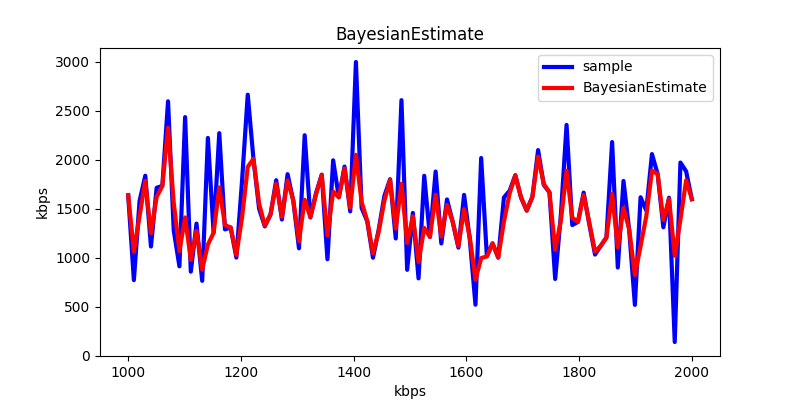
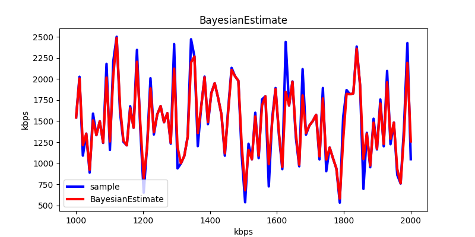

对于类 `AcknowledgedBitrateEstimator` 的实现，核心是调用 `BitrateEstimator`。前者通过对某段时间内的传输的数据量进行取样，然后作为参数传入后者的 `Update` 函数中，`Update` 函数的实现核心则是一个**贝叶斯估计**算法，这篇文章将对这部分进行重点分析。

# 贝叶斯估计原理

已知：**正态均值**（方差已知）的共轭先验分布是正态分布。

设 $x_1$，...，$x_n$ 是来自正态总体$N(\theta, \sigma^2)$的一个样本，其中方差$\sigma^2$已知，若取$\theta$的共轭先验分布$N(\mu, \tau^2)$作为$\theta$的先验分布，其中$\mu$与$\tau^2$已知，则其$\theta$的后验分布也为正态分布$N(\mu_1, \sigma_1^2)$，其中$\mu_1$与$\sigma_1$关系如下：

$$
\mu_1 = \frac{\overline x\sigma_o^{-2} + \mu\tau^{-2}}{\sigma_o^{-2}+\tau^{-2}} \tag{1}
$$

$$
\frac{1}{\sigma_1^2} = \frac{1}{\sigma_o^2} + \frac{1}{\tau^2} \tag{2}
$$
其中：
$$
\sigma_o^2=\sigma^2/n，\overline x=\frac{1}{n}\sum_1^nx_i
$$

由于正态分布的对称性，$\theta$的三种贝叶斯估计（中位数，众数和期望值）重合，即$\hat\theta_{MD}=\hat\theta_{Mr}=\hat\theta_{E}$，或者说$\theta$的贝叶斯估计为：

$$
\hat\theta_B=\frac{\tau^{-2}}{\sigma_o^{-2}+\tau^{-2}}\cdot\mu+\frac{\sigma_o^{-2}}{\sigma_o^{-2}+\tau^{-2}}\cdot\overline x = \frac{\sigma_o^2\mu+\tau^2\overline x}{\sigma_o^2+\tau^2} \tag{3}
$$

$$
\hat\sigma_B^2=\frac{\sigma_o^2\cdot \tau^2}{\sigma_o^2 + \tau^2} \tag{4}
$$

其中 $\sigma_o^2 = \frac{\sigma^2}{n}$，$n$为样本数，$\overline x$ 为样本均值。

可以看出$\hat\theta_B$是先验均值与样本均值的加权平均，当样本量大时取决于样本均值，因为在方程（3）中，先验均值$\mu$的加权值为$\tau^{-2}$，样本均值的加权值为$\sigma_o^{-2}$，其加权平均就为公式（3）。

# Update函数实现

函数参数包括接收到 `transport feedback` 反馈包的时间 `at_time`，收到的反馈字节数 `amount`，当前是否处于 `Application limited region` 的标志位。

首先通过调用 `UpdateWindow` 计算一个取样窗口内的码率，赋值变量 `bitrate_sample_kbps`。该函数的原理是给定一个时间窗口，默认为 `150ms`，然后通过传入参数中的字节数，如在这个 `150ms` 的窗口期内接收到了 `150bytes`，则可以得出取样码率 `8kbps`。

算法中将样本不确定性，也就是标准差，定义为与当前估计值相差多远的函数。 在 `uncertainty_symmetry_cap_` 的值较低的情况下，增加的不确定性多于减少的不确定性。

$$
\sigma^2=\left(S\cdot\left(\frac{|\theta - \overline x|}{\theta+C}\right)\right)^2
$$

其中，常数 $S$ 为默认标准差，代码中为 `10.0`，$C$ 为变量 `uncertainty_symmetry_cap_` 与 $\overline x$中的较小值，除法结果值的意义就是得到样本均值与当前估计值相差多远。

代码实现如下：
``` cpp
  float sample_uncertainty =
      scale * std::abs(bitrate_estimate_kbps_ - bitrate_sample_kbps) /
      (bitrate_estimate_kbps_ +
       std::min(bitrate_sample_kbps,
                uncertainty_symmetry_cap_.Get().kbps<float>()));

  float sample_var = sample_uncertainty * sample_uncertainty
```

接着就是对贝叶斯估计的代码实现，对照公式（3），初始化时，取第一次取样时的码率 `bitrate_estimate_kbps_` 为样本$\theta$的共轭先验分布的$\mu$，`sample_var` 为样本$\sigma_o^2$，`pred_bitrate_estimate_var` 为样本$\theta$共轭先验分布的$\tau^2$，$\overline x$ 为样本均值，代入公式得到 $\hat \theta_B$，也就是我们要的码率的贝叶斯估计，赋值给变量 `bitrate_estimate_kbps_`。

同样通过公式（4）算得共轭先验分布的方差 `bitrate_estimate_var_`。在使用前加 `5.0`，以模拟比特率随时间变化时，比特率估计不确定性会增加。

代码实现如下：

``` cpp
float pred_bitrate_estimate_var = bitrate_estimate_var_ + 5.f;
bitrate_estimate_kbps_ = (sample_var * bitrate_estimate_kbps_ +
                          pred_bitrate_estimate_var * bitrate_sample_kbps) /
                         (sample_var + pred_bitrate_estimate_var);
bitrate_estimate_kbps_ =
    std::max(bitrate_estimate_kbps_, estimate_floor_.Get().kbps<float>());
bitrate_estimate_var_ = sample_var * pred_bitrate_estimate_var /
                        (sample_var + pred_bitrate_estimate_var);
```

# 可视化

通过公式还不是特别明显，我们通过图像来展示下。

首先对以上的实现输入一个 $N(1500, 100^2)$ 的满足正态分布的一个带宽样本，其均值为 1500 ,标准差为100，得到如下输出：



可以看到，红色的代表贝叶斯估计的线基本与我们输入码率样本重合，也就是在这个码率参数下，估计值和取样值基本相同。

接着修改参数，输入一个 $N(1500, 500^2)$ 的满足正态分布的一个带宽样本，其均值还是为 1500，标准差为一个偏大值500，得到如下输出：



明显看到红色代表的贝叶斯估计的线不会跟着我们输入的样本剧烈抖动，而是在一个输入样本缓和的多的范围内抖动。

在第二组参数的基础上，尝试加大 `uncertainty_symmetry_cap_`，将其从 `0` 修改为 `1500`，得到如下图像：



可以看到贝叶斯估计的值又一次取决于样本均值，因为 $\sigma^2$ 变的极小，$\theta$的共轭先验分布的 $\mu$ 的对估计影响变小，估计值受到的影响就基本全部来自于样本 $\overline x$.
