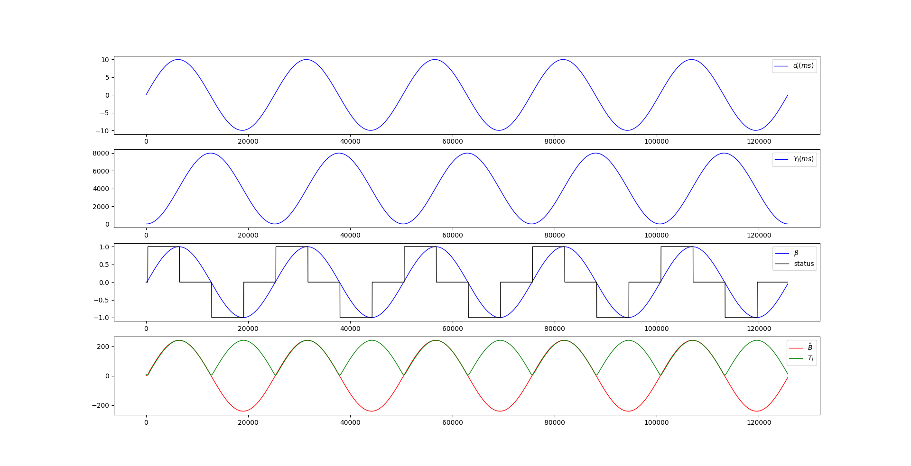

新版本的基于延迟的带宽控制算法实现于 `webrtc` 的发送端。根据[draf-ietf-rmcat-gcc-02]中的描述，它可以被分成四个部分：一个预过滤器（`pre-filtering`），一个到达时间过滤器（实际代码中是一个简单线性回归模型），一个过载检测器（`over-use detector`）和一个速率控制器（`rate controller`）。

基于延迟的带宽控制算法主要实现于 `DelayBasedBwe` 和 `TrendLineEstimation` 这两个类中。在接收到一个 `RTCP Feedback` 包后，`DelayBasedBwe` 会简单计算出延迟相关的参数，然后交给 `TrendLineEstimation` 通过简单线性回归和特定的数学模型，得出当前网络状态的预测值。这篇文章将基于 `webrtc` 的源码，分析上面提到的这四个部分中的前三个的实现及其原理，探究如何通过延迟得到正确的网络状态，与 `AIMD` 速率控制相关的内容在另一篇文件中介绍。

# 到达时间模型

整个带宽控制算法的驱动力来自于接收到的 `RTCP Feedback` 包，其定义在 [draft-holmer-rmcat-transport-wide-cc-extensions] 中，接收端会将收到每个包的时间记录下来，以 `reference time` 和 `delta` 的方式，封装进 `feedback` 中，然后发送给发送端，用于发送端的带宽预测。

我们将两组包到达时间的间隔定义为 $t_i - t_{i-1}$，也就是组间到达时间（`inter-arrival`）。相应的，将两组包出发时间的间隔定义为 $T_i - T_{i-1}$，也就是组间出发时间（`inter-departure`）。最后，将组间延迟变化量 $d_i$ 定义为上面两种间隔的差值：

$$
d_i = t_i - t_{i-1} - (T_i - T_{i-1}) \tag{1}
$$

连续分组之间的出发间隔时间计算为 $T_i-T_{i-1}$，其中 $T_i$ 是当前正在处理的数据包组中最后一个数据包的出发时间。所有乱序的包都会被到达时间模型所忽略。

每个组被分配一个接收时间 $t_i$ ，该时间对应于该组最后一个数据包被接收的时间。 如果 $d_i > 0$，即如果组间到达时间大于组间出发时间，则相对于其前一个组而言，当前组被延迟。

从代码上看，对组间到达时间和组间出发时间的计算如下：
``` cpp
void DelayBasedBwe::IncomingPacketFeedback(const PacketResult& packet_feedback,
                                           Timestamp at_time) {
  // 如果当前接收到反馈包的时间与上次接收到反馈包的间隔大于 kStreamTimeOut,默认为2s
  // 则重置组间延迟变化的计算和线性回归模型
  if (last_seen_packet_.IsInfinite() ||
      at_time - last_seen_packet_ > kStreamTimeOut) {
    inter_arrival_.reset(
        new InterArrival((kTimestampGroupLengthMs << kInterArrivalShift) / 1000,
                         kTimestampToMs, true));
    delay_detector_.reset(
        new TrendlineEstimator(key_value_config_, network_state_predictor_));
  }
  ...
  // 计算组间到达时间 |t_delta| = t(i) - t(i-1)  和 组间出发时间 |ts_delta_ms| = T(i) - T(i-1)，通过这两个值可以直接计算如该组的组间延迟变化量 d_i
  bool calculated_deltas = inter_arrival_->ComputeDeltas(
      timestamp, packet_feedback.receive_time.ms(), at_time.ms(),
      packet_feedback.sent_packet.size.bytes(), &ts_delta, &t_delta,
      &size_delta);
  double ts_delta_ms = (1000.0 * ts_delta) / (1 << kInterArrivalShift);

  // 将参数传入数学模型中，以更新网络状态，主要实现于 TrendlineEstimatior::UpdateTrendline 中，下面会祥解
  delay_detector_->Update(
      t_delta, ts_delta_ms, packet_feedback.sent_packet.send_time.ms(),
      packet_feedback.receive_time.ms(),
      packet_feedback.sent_packet.size.bytes(), calculated_deltas);
```

# 预过滤器

预过滤的目的是处理由信道中断引起的瞬时延迟。 在信道中断期间，由于与拥塞无关的原因，在网络缓冲区中排队的数据包在信道恢复后会以突发的方式传送。预过滤将以突发方式到达的数据包组合并在一起。如果这两个条件中的任何一个符合，数据包就会被合并到同一个组中：

- 在一个 `burst_time` 间隔内发送的一系列的包构成一个组。建议 burst_time 为5ms。

- 如果一个数据包的间隔到达时间小于 `burst_time`，并且组间延迟变化 `d(i)` 小于0，则该数据包被认为是当前数据包组的一部分。

# 简单线性回归模型

在 [draf-ietf-rmcat-gcc-02] 中提到，这里应该实现一个基于卡尔曼过滤器的到达时间过滤器。但其实早在2016年的[修改项中](https://webrtc.googlesource.com/src/+/afaef8bbebb8aecd32b3b7c5e47d60fd5526a126)，将带宽预测算法全部移到发送端实现后，在接收端实现的卡尔曼滤波器，就被替换成了在发送端的一个简单线性回归模型，所以需要以简单线性回归模型来理解这部分的逻辑，而不能根据标准中提到的内容去理解。

以 $d_i$ 为时间 $i$ 时的组间延迟变化量，以 $S_i$ 为时间 $i$ 时延迟变化量的累加，$Y_i$ 为 $S_i$ 指数平滑后的结果，则有：

$$
S_i = d_i + Y_{i-1} \tag{2}
$$

$$
Y_i = \alpha \cdot Y_{t-1} + (1 - \alpha) \cdot S_i \tag{3}
$$

- 系数 $\alpha$ 表示权重上升的程度，它是介于0和1之间的恒定平滑因子。较高的 $α$ 会使较早的观测值更慢地降低权重。在源码中，$\alpha$ 默认取值 0.9。

这部分逻辑实现于 `TrendlineEstimator::UpdateTrendline` 函数中，从 `Update` 函数中进入：

``` cpp
void TrendlineEstimator::UpdateTrendline(double recv_delta_ms,
                                         double send_delta_ms,
                                         int64_t send_time_ms,
                                         int64_t arrival_time_ms,
                                         size_t packet_size) {
  ...                                           
  // 计算组间延迟变化量 |delta_ms|，公式（1）
  const double delta_ms = recv_delta_ms - send_delta_ms;
  ++num_of_deltas_;
  num_of_deltas_ = std::min(num_of_deltas_, kDeltaCounterMax);
  ...
  // 计算 S_i，公式（2）
  accumulated_delay_ += delta_ms;
  ...
  // 指数平滑，计算 Y_i，公式（3）
  smoothed_delay_ = smoothing_coef_ * smoothed_delay_ +
                    (1 - smoothing_coef_) * accumulated_delay_;
  ...

  // 统计时长和组间延迟累加的组合
  delay_hist_.push_back(std::make_pair(
      static_cast<double>(arrival_time_ms - first_arrival_time_ms_),
      smoothed_delay_));
  if (delay_hist_.size() > window_size_)
    delay_hist_.pop_front();
  double trend = prev_trend_;
  if (delay_hist_.size() == window_size_) {
    // 如果可以对数据进行拟合，则更新trend_，
    // 计算得到的 trend_ 可以看成是 (send_rate - capacity)/capacity 的一个预测值
    // 0 < trend < 1   ->  延时增加, 网络队列可能已经满了 
    //   trend == 0    ->  延时没有改变
    //   trend < 0     ->  延时减少，网络队列可能已经清空
    // 简单线性回归
    trend = LinearFitSlope(delay_hist_).value_or(trend);
  }
  ...
  // 速率探测
  Detect(trend, send_delta_ms, arrival_time_ms);

```

这里使用简单线性回归（`SLR`）对组间延迟变化量的累加结果 $Y_i$ 进行建模，它是一个关于统计时长和斜率的方程。我们将统计时长记为 $X_i$，则回归式为：

$$
Y_i = \alpha + \beta \cdot X_i + \epsilon
$$

为了从一组样本 $(y_i, x_i)$（其中 $i = 1,\  2, \ldots, n$ ）之中估计最合适（误差最小）的 $\alpha$ 和$\beta$ ，通常采用最小二乘法，其计算目标为最小化残差平方和：


$$
\sum_{i=1}^{n}\epsilon_{i}^{2} = \sum_{i=1}^{n}(y_{i}-\alpha -\beta x_{i})^{2}
$$


使用微分法求极值：将上式分别对$\alpha$ 和 $\beta$ 做一阶偏微分，并令其等于0：

$$
\begin{cases}
n\ \alpha + \sum\limits_{i = 1}^n x_i\  \beta = \sum\limits_{i = 1}^n y_i \\\\
\sum\limits_{i = 1}^n x_i\  \alpha + \sum\limits_{i = 1}^n x_i^2\  \beta = \sum\limits_{i = 1}^n x_i y_i
\end{cases}
$$

此二元一次线性方程组可用克莱姆法则求解，得解$\hat\alpha,\  \hat\beta$：

$$
\hat\beta = \frac {n \sum\limits_{i = 1}^n x_i y_i - \sum\limits_{i = 1}^n x_i \sum\limits_{i = 1}^n y_i} {n \sum\limits_{i = 1}^n x_i^2 - \left(\sum\limits_{i = 1}^n x_i\right)^2}=\frac{\sum\limits_{i = 1}^n(x_i-\bar{x})(y_i-\bar{y})}{\sum\limits_{i = 1}^n(x_i-\bar{x})^2} \tag{4}
$$

$$
\hat\alpha = \frac {\sum\limits_{i = 1}^n x_i^2 \sum\limits_{i = 1}^n y_i - \sum\limits_{i = 1}^n x_i \sum\limits_{i = 1}^n x_iy_i} {n \sum\limits_{i = 1}^n x_i^2 - \left(\sum\limits_{i = 1}^n x_i\right)^2}= \bar y-\bar x \hat\beta \tag{5}
$$

实现于 `LinearFitSlope` 函数中：

``` cpp
// 对趋势值的计算
absl::optional<double> LinearFitSlope(
    const std::deque<std::pair<double, double>>& points) {
  RTC_DCHECK(points.size() >= 2);
  // Compute the "center of mass".
  double sum_x = 0;
  double sum_y = 0;
  for (const auto& point : points) {
    sum_x += point.first;
    sum_y += point.second;
  }
  double x_avg = sum_x / points.size();
  double y_avg = sum_y / points.size();
  // Compute the slope k = \sum (x_i-x_avg)(y_i-y_avg) / \sum (x_i-x_avg)^2
  double numerator = 0;
  double denominator = 0;
  for (const auto& point : points) {
    numerator += (point.first - x_avg) * (point.second - y_avg);
    denominator += (point.first - x_avg) * (point.first - x_avg);
  }
  if (denominator == 0)
    return absl::nullopt;
  return numerator / denominator;
}
```

# 过度使用（`over-use`） 探测器

过度使用探测器的作用是确定当前的网络拥塞状态，它将线性回归模型的趋势 $\hat\beta$ 与阈值 `theshold` 进行比较。 如果高于阈值则被说明当前可能正处于 `over-use` 状态。，但单纯这样的指示还不足以让检测器向速率控制子系统发出 `over-use` 信号。 只有当持续检测到 `over-use` 状态长达 `overuse_time_th` 毫秒时，且 $\hat\beta$ 相比上次有增加时，才会发出明确的 `over-use` 信号。同样，当 $\hat\beta$ 小于阈值时，会检测到相反的状态，即 `under-use`。 如果既没有检测到 `over-use` 也没有检测到 `under-use`，探测器将处于正常状态 `normal`。

``` cpp
void TrendlineEstimator::Detect(double trend, double ts_delta, int64_t now_ms) {
  ...
  // 将趋势放大
  const double modified_trend =
      std::min(num_of_deltas_, kMinNumDeltas) * trend * threshold_gain_;
  ...
  if (modified_trend > threshold_) {
    if (time_over_using_ == -1) {
      // 初始化计时器
      // 假设从上次取样到现在已经 `over-use` 了一半的时间
      time_over_using_ = ts_delta / 2;
    } else {
      // 计时器累加
      time_over_using_ += ts_delta;
    }
    overuse_counter_++;
    //计时器超时，触发 `over-use` 检测
    if (time_over_using_ > overusing_time_threshold_ && overuse_counter_ > 1) {
      // `over-use` 进一步加剧，可以确定当前网络过载
      if (trend >= prev_trend_) {
        time_over_using_ = 0;
        overuse_counter_ = 0;
        hypothesis_ = BandwidthUsage::kBwOverusing;
      }
    }
  } else if (modified_trend < -threshold_) {
    time_over_using_ = -1;
    overuse_counter_ = 0;
    hypothesis_ = BandwidthUsage::kBwUnderusing;
  } else {
    time_over_using_ = -1;
    overuse_counter_ = 0;
    hypothesis_ = BandwidthUsage::kBwNormal;
  }
  prev_trend_ = trend;
  UpdateThreshold(modified_trend, now_ms);
}
```

可以注意到逻辑比较简单，其先对 $\hat\beta$ 进行了放大，将放大后的值定义为 $\hat B$ ，它不会影响状态的判断，因为阈值也是动态计算的，这也是这部分探测复杂的地方。阈值对算法的整体动态和性能有显著的影响。 特别是已经证明过，如果使用静态阈值，`delay-based` 算法控制的流会被并发的 `TCP` 流饿死（参考[Pv13]）。 通过将阈值增加到足够大的值，就可以避免这种饥饿现象。通过使用较大的阈值，可以容忍较大的队列延迟，而使用较小的阈值，过度使用检测器会对 $\hat\beta$ 值的小幅增加迅速做出反应，产生一个 `over-use` 信号，降低基于延迟的可用带宽的估计值。 因此，有必要动态调整阈值，以便在最常见的情况下获得良好的性能，如在与基于丢包的算法竞争流量时。

因此标准推荐根据以下动态方程改变阈值 $T_i$：

$$
T_i = T_{i-1} + (t_i - t_{i-1}) * K_i * (|\hat B| - T_{i-1}) \tag{6}
$$

其中 $K_i$ 的取值如下：
$$
K_i=\begin{cases}
K_d,\quad \hat B < T_{i-1} \\\\
K_u,\quad \hat B >= T_{i-1}
\end{cases} \tag{7}
$$

这个公式的原理是，当 $\hat B$超出阈值范围 $[-T_{i-1},\quad T_{i-1}]$ 时，增加阈值 $T_i$ ，而当趋势 $\hat B$ 回落到范围内时，阈值就会减少。 这样，当 $\hat B$ 增加时，例如由于 `TCP` 流进入同一瓶颈，$T_{i}$ 就会增加，从而避免了不可控的产生 `over-use` 信号，导致 `delay-based` 的流量被饿死（参考[Pv13]）。 

此外，在下面这种情况下，$T_{i}$ 也不应该被更新:

$$
|\hat B| - T_i > 15
$$

同时，标准中建议对 $T_i$ 的取值范围控制在 $[6, 600]$ 的范围内，因为太小会导致检测器过于敏感。

另一方面，当 $\hat B$ 回落到 $[-T_{i-1},\quad T_{i-1}]$ 的范围内时，阈值 $T_i$ 就会降低，这样就可以实现较低的队列延迟。

标准建议选择 $K_u > K_d$，这样阈值增加的速率要高于减少的速率，可以在并发 `TCP` 流的情况下增加阈值，防止饿死，同时也可以增强相同协议间的公平性。这一点在代码实现中，又打了标准的脸，因为这两个值默认分别是 0.0087 和 0.039，也就是 $K_u < K_d$，相比标准来说更保守了一些，避免了过度占用带宽。

# 可视化

我们假设输入是一个满足正弦变换的延迟变化量，即：

$$
d_i = 10 * sin(x / 2000)，\quad x \in [0, \quad 40\pi]
$$

状态值：

$$
status=\begin{cases}
1,\quad over-use \\
0,\quad normal \\
-1,\quad under-use \\
\end{cases}
$$

结果：


# 最后

通过 `over-use` 探测器后，我们就得到了当前网络的拥塞状态，通过这个状态控制当前发送速度应该升高，降低还是应该保持不变，至于具体应该变化多少，这属于码率控制的内容了，以后会做分析。

[draf-ietf-rmcat-gcc-02]: https://tools.ietf.org/html/draft-ietf-rmcat-gcc-02
[draft-holmer-rmcat-transport-wide-cc-extensions]: https://tools.ietf.org/html/draft-holmer-rmcat-transport-wide-cc-extensions-01
[Pv13]: https://www.researchgate.net/publication/260200748_Understanding_the_Dynamic_Behaviour_of_the_Google_Congestion_Control_for_RTCWeb
