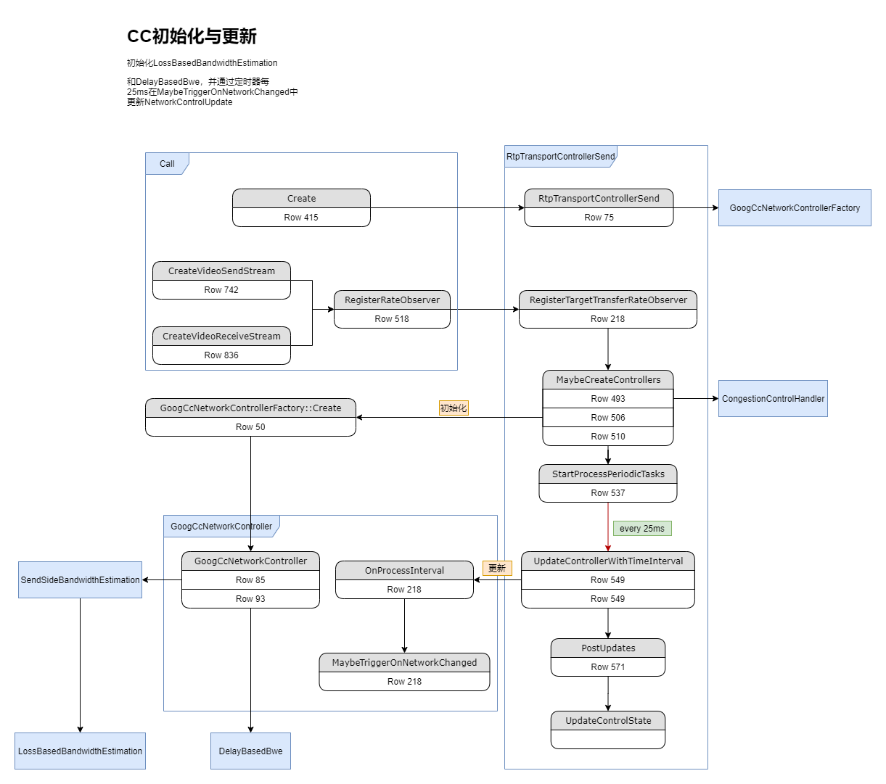
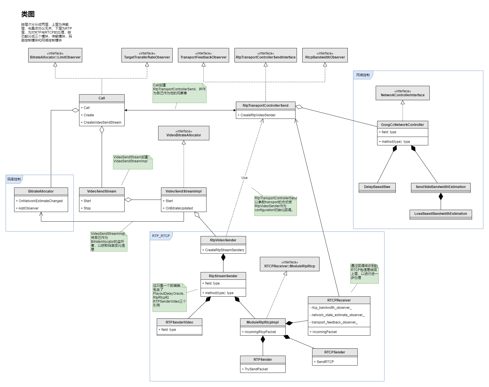

# WebRTC 拥塞控制简介

`CC` 就是我们常说的拥塞控制（`congestion control`），`WebRTC` 中实现了三套拥塞控制算法，包括 `GCC`，`BBR` 和 `PCC`。我们这里讨论的是 `WebRTC` 中是如何搭建这一套框架，`CC` 如何初始化，更新，进而影响到码率和发送。这篇文章并不对这个某个算法做详细解析，而是将它做一个整体，一个称为 `CC` 的整体，但我们还是会以在发送端实现的 `GCC` 为例去解析整个数据流动和反馈的过程。

`GCC` 也就是 `google congestion control`，是为人熟知的 `WebRTC CC` 算法，其主要分成两部分，一个是基于丢包的拥塞控制（`loss-base`），另一个是基于延迟的拥塞控制（`delay-base`）。在早期在实现中，两个拥塞算法分别在发送端和接收端实现，接收端会基于丢包计算出估计带宽，然后通过 `RTCP` 的 [REMB] 包反馈给发送端，发送端再综合两个控制算法的结果得出一个最终的码率，并以些码率进行发送。在我当前分析代码的版本中，这两个拥塞控制都已经移到发送端进行实现，这样做有一个明显的好处就是，接收端不再需要关心拥塞控制相关的逻辑，而发送端也可以灵活更新自己的控制算法而不需要更新接收端，一般来说发送端都会有更多的修改。

当前代码版本为 `WebRTC master` 分支，提交号 `e6f9bd000949fe31b177cef8311792a1f8f5563d`。

# 拥塞控制初始化与更新

`GCC` 实现于 `GoogCcNetworkController` 中，其初始化由 `RtpTransportControllerSend` 负责。同时，我们也可以看到 `RtpTransportControllerSend` 类一个很重要的作用就是控制更新逻辑，简单来讲，他维护了一个定时器，每25ms触发一次，然后获取当前维护的最新的带宽，RTT等网络数据。

# RTCP 包处理与回调设置

RTCP 包的解析和回调由 `RTCPReceiver` 完成，`ModuleRtpRtcpImpl` 是对 `RTP` 和 `RTCP` 操作集的一个封装，所以所有 `RTP` 和 `RTCP` 的操作都通过调用它来完成。

回调的设置需要借助 `Configuration` 类完成，通过将`Configuration` 中`bandwidth_callback`，`network_state_estimate_observer` 和 `transport_feedback_callback` 设置为 `RtpTransportControllerSend` 指针，实现在收到 `RTCP` 数据包后，将解析后的数据给回 `RtpTransportControllerSend`，再由 `RtpTransportControllerSend` 调用  `CC` 相关的逻辑，以实现对拥塞控制的调用和网络参数的更新。

# 网络参数回流

上面也提到，在接收 `RTCP` 包后可能会更新网络参数，如带宽等，这些数据会通过回调函数回到上层 `Call` 中，然后作用于 `BitrateAllocator`，`BitrateAllocator` 会基于优先级对所有的 `stream` 分配码率，分配后的码率会进一步影响 `VideoStreamEncoder` 和 `RtpVideoSender`，从而影响编码参数和发送码率。

# 整体类图

从整体类图上看，码率控制和拥塞控制的关系并不像我们刚开始看起来那么的密切的，它们在设计上和实现上也是完全分开的，只是码率控制在一定程度上依赖于拥塞控制获取到的网络带宽数据。另外也可以看到，`WebRTC` 在传输设计上的的分层结构，上层由 `Stream` 相关的类实现，只负责逻辑和对抽象的调用，底层由 `RTP/RTCP` 相关的类实现，负责具体的处理。

[REMB]: https://tools.ietf.org/id/draft-alvestrand-rmcat-remb-03.html