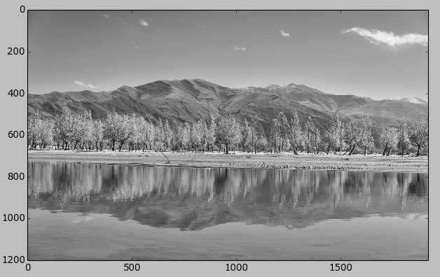
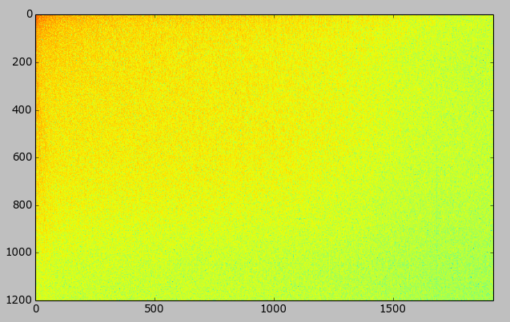
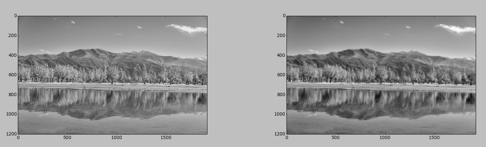
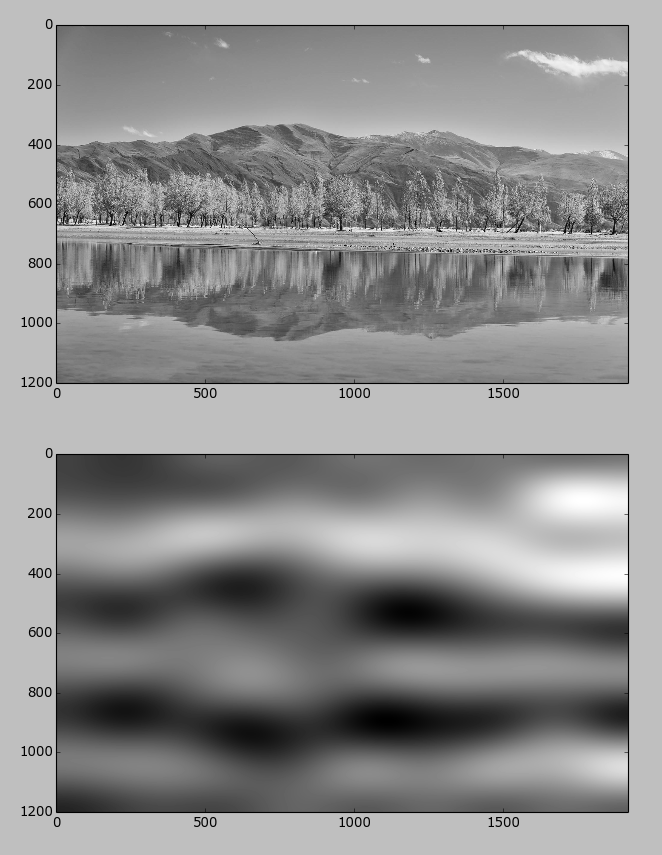

# 简介
1807年，法国数学家、物理学家傅里叶（Jean Baptiste Joseph Fourier）提出了傅里叶变换（Fourier Transform, FT），但傅里叶变换包含复数运算，导致运算的复杂度和存储长度都超过实数运行，为了简化运算过程，同时达到更好的变换效果，余弦变换应运而生。

二维离散傅里叶变换(DFT)：

离散余弦变换(DCT):

从物理效果看，傅立叶变换可以将图像从空间域转换到频率域，其逆变换是将图像从频率域转换到空间域。换句话说，傅立叶变换的物理意义是将图像的灰度分布函数变换为图像的频率分布函数，傅立叶逆变换是将图像的频率分布函数变换为灰度分布函数。

## 空间域和频率域

空间域又称图像空间，由图像像元组成的空间。在图像空间中以长度（距离）为自变量直接对像元值进行处理称为空间域处理。
频率域是指以频率（即波数）为自变量描述图像的特征，可以将一幅图像像元值在空间上的变化分解为具有不同振幅，空间频率和相位的简振函数的线性叠加，图像中各种频率成分的组成和分布称为空间频谱。这种对图像的频率特征进行分解，处理和分析，被称为频率域处理或波数域处理。
离散余弦算法的核心作用就是将图像从空间域变换为频率域，把由色块组成的图像变为由基准色调与图像细节组成。在频率域中低频部分代表图片的基准色调，而高频部分代表图像的细节。图像的频率是表征图像中灰度变化剧烈程序的指标，是灰度在平面空间内的梯度。在频谱图上，我们看到的明暗不一的亮点，实际图像上某一点与领域点差异的强弱，即梯度的大小，也即该点频率的大小。

空间域：

转换为频率域:

## 为什么要转换

空间图像数据通常是很难压缩的：相邻的采样点具有很强的相关性（相互关联的），而且能量一般平均分布在一幅图像中，很难做到丢掉某些数据和降低数据精度而不明显影响图像质量。而通过域的转换，利用的是“在频率域下，人眼对高频信息不敏感”，从而可以丢弃部分高频信息来使得压缩更顺利。在JPEG标准压缩中，首先将图像分成一系列8x8的小块，对每个小块先使用离散余弦变换从空间域转换到频率域，然后量化编码。每一个小块做DCT变换之后，成了频率域下的64个频率系数，而高频部分很多都是0。对于连续的0，要压缩就变得容易多了，比如JPEG标准里面是量化后（有损过程，为了把高频的一些较小数值转化为0），按照ZigZag顺序（为了配合量化表，使连续的0的数量尽量多），用游长编码来进行压缩。

## 压缩后的效果

我采用8x8宏块大小，进行DCT运行后，只取一个高频数据后的效果：

可以明显的看到相片的对比度非常低了，因为我们只保留了64个频率数值中最高的一个，所以宏块间的灰度的梯度可能很大，导致块效应非常严重。

假如我们不采用8x8宏块，我们对整张图片进行DCT运行，并只取频率中最大的10x10个频率，得到的图像：

坏消息是完全不知道是什么东西了，好消息是他被压缩到了极小的空间里。

## 如何实验

很多库里都提供了DCT/IDCT函数，我们只需要直接调用就可以了。
我实验的例子可以在https://github.com/shmilycode/DCT 下载源码。