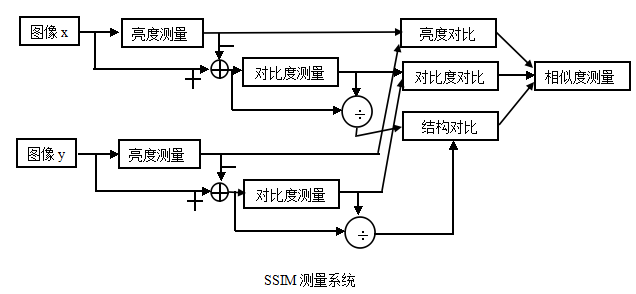

# 背景 

图像质量评价可以分为主观评价方法和客观评价方法，由名称就可以知道，前者是通过人眼去对图像质量进行主观评分，一般会采用 `MOS(MeanOptionScore)` 或 `DMOS(DifferentialMeanOptionScore)`，后者则是用机器或程序来评价视频质量，这篇文章主要关注后者。我将会在下文介绍几种常用的质量评价算法，包括 `MSE`，`PSNR`，`SSIM`，`MSSIM`和`VMAF`，前面三种都是基于传统的算法，最后一种基于机器学习，为控制篇幅，最后一种会在另一篇文章中作说明。

通过图像质量评价，我们可以客观的得到关于图像质量相关的信息，从而可以指导我们对图像进行优化，像 `NETFLIX` 或 `Youtube` 这样的视频网站，他们都有自己的算法来确保提供给处于不同网络状态和有不同需求的客户最高质量的画质。

## MSE(Mean-Square Error)

给定一个大小为 $m \times b$ 的干净图像 ***I*** 和噪声图像 ***K*** ，均方误差 ***(MSE)*** 定义为：

$MSE=\frac{1}{mn}\sum_{i=0}^{m-1}\sum_{j=0}^{n-1}[I(i,j) - K(i,j)]^2$

这是一个基于误差敏感度（error sensitivity）的质量评估方法，均方误差是反映估计量与被估计量之间差异程度的一种度量。均方误差是评价点估计的最一般的标准，自然，我们希望估计的均方误差越小越好。均方根误差的计算很简单，只需要两张图片的像素逐个比较差值的平方然后求平均就可以，但缺点也很明显，`MSE` 会给离群点赋予更高的权重，但是却是以牺牲其他正常数据点的预测效果为代价的，这最终会降低模型的整体性能，所以我们作图像质量评价一般也不会直接使用 `MSE`。

``` python
import skimage.measure import compare_mse

mse = compare_mse(origin_img, target_img)
```

## PSNR (Peak Signal to Noise Ratio)

峰值信噪比算法的计算需要用到 `MSE`，其定义为：

$PSNR = 10 \times log_{10}(\frac{MAX_I^2}{MSE})$

其中$MAX_I^2$为图片的最大像素值的平方，如一般的灰度图像的像素由8位二进制表示，则其最大像素值就为$2^8-1=255$。公式中的 `MSE` 为上面提到的均方误差。

对于彩色图像的计算一般有三种方法：

1. 分别计算 `RGB `三个通道的 `PSNR` ，然后取平均；
2. 计算 `RGB` 三通道的 `MSE`，然后取平均，再计算 `PSNR`；
3. 将图片转化为 `YCbCr` 格式，然后只计算 `Y` 分量也就是亮度分量的 `PSNR`；

其中第二和第三种方法比较常见。

PSNR是最普遍和使用最为广泛的一种图像客观评价指标，一般得分越高意味着图片质量越好，但其本质上还是基于对应像素点间的误差，即基于误差敏感的图像质量评价，而没有考虑到人眼的视觉特性，因而经常出现评价结果与人的主观感觉不一致的情况。
  
``` python
import skimage.measure import compare_psnr

psnr = compare_psnr(origin_img, target_img)
```

## SSIM (Structural Similarity)

大多数的基于误差敏感度（error sensitivity）的质量评估方法(如MSE,PSNR)使用线性变换来分解图像信号，这不会涉及到相关性。`SSIM` 就是要找到更加直接的方法来比较失真图像和参考图像的结构。`SSIM` 对相似度的测试由三种对比模块组成，分别为：亮度，对比度，结构，测试系统可以表示为如下图：

<div align=center></div>

下面定义三个对比函数。

亮度的对比函数：

$l(x,y) = \frac{2\mu_x\mu_y+C_1}{\mu_x^2+\mu_y^2+C_1}$

对比度对比函数：

$c(x,y) = \frac{2\sigma_x\sigma_y+C_2}{\sigma_x^2+\sigma_y^2+C_2}$

结构对比函数：

$s(x,y) = \frac{\sigma_{xy}+C_3}{\sigma_x\sigma_y+C_3}$

把三个函数组合起来，得到 `SSIM` 指数函数：

$SSIM(x,y) = [l(x,y)]^\alpha[c(x,y)]^\beta[s(x,y)]^\gamma$

这里引入 $\alpha, \beta, \gamma$ 以调整三个模块间的重要性，但为了简化形式，一般会设 $\alpha = \beta = \gamma = 1$，$C_3 = C_2/2$，于是得到我们常用的：

$SSIM(x,y) = \frac{(2\mu_x\mu_y+C_1)(2\sigma_{xy}+C_2)}{(\mu_x^2+\mu_y^2+C_1)(\sigma_x^2+\sigma_y^2+C_2)}$

接下来是关于实际使用中的具体运算。

首先，对于离散信号，我们以平均灰度作为亮度测量的估计：

$\mu_x = \frac{1}{N}\sum_{i=1}^{N}{x_i}$

亮度对比函数$l(x,y)$是关于$\mu_x，\mu_y$ 的函数，这里$x, y$对应的是参考图像和对比图像。常数$C_1$是为了避免$\mu_x^2+\mu_y^2$接近0 时造成系统的不稳定，一般情况下我们选择$C_1=(K_1L)^2$，L为图像灰度级数，对于8-bit灰度图像，L=255，$K1 << 1$（远小于1）。

然后，由上图的测试系统可以知道需要把平均灰度值从信号中去除，对于离散信号$x - \mu_x$，可使用标准差来做对比度估量值：

$\sigma_x = \left( \frac{1}{N-1}\sum_{i=1}^{N}(x_i-\mu_x)^2 \right)^\frac{1}{2}$

对比度对比函数$c(x,y)$是关于$\sigma_x, \sigma_y$的函数。常数$C_2=(K_2L)^2$，且$K_2<<1$。

最后，信号被自己的标准差相除，结构对比函数被定义成$\frac{x-\mu_x}{\sigma_x}$和$\frac{y-\mu_y}{\sigma_y}$的函数，将这两个公式直接乘，得到：
$\frac{x-\mu_x}{\sigma_x} \times \frac{y-\mu_y}{\sigma_y} = \frac{(x-\mu_x)\times(y-\mu_y)}{\sigma_x\sigma_y}$，其中分子就是$x,y$的协方差$\sigma_{xy}$。

## MSSIM (Mean Structural Similarity)

在实际使用中，直接对整个图片使用`SSIM`, 得到结果的指导意义其实不大，相反，局部求 `SSIM` 指数的效果要好于全局，因为图像的统计特征通常在空间中分布不均，而且图像的失真情况在空间中也是变化的，再者人们只能将视线聚集在图像的一个区域内，所以局部处理会更符合人类视觉系统的特点，而且通过局部质量检测得到的图片空间质量变化的映射矩阵可服务于其他应用。其实考虑一个实际情况，对整个图片求灰度的均值，真的能代表整个图像的灰度情况吗？对于一张细节丰富的图片来说，肯定是不行的。

所以在使用时，可以加入一个8*8的方形窗，然后每一次对$\mu_x, \sigma_x, \sigma_{x,y}$的计算都是基于窗口内的像素的，最终可以得到一个 `SSIM` 矩阵，由局部 `SSIM` 指数组成。再者，简单的加权（加窗）会使矩阵出现不良的分块效应，所以使用$11*11$的对称高斯加权函数 $W=\{w_i|i=1,2,...N\}$，则$\mu_x, \sigma_x, \sigma_xy$的估计表示为：

$\mu_x = \frac{1}{N}\sum_{i=1}^{N}{w_ix_i}$

$\sigma_x = \left( \frac{1}{N-1}\sum_{i=1}^{N}w_i(x_i-\mu_x)^2 \right)^\frac{1}{2}$

$\sigma_{xy} = \sum_{i=1}^{N}w_i(x_i-\mu_x)(y_i-\mu_y)$

在这里，由一些成熟的实验结果的总结，我们会把$K1$高为0.01，$K2$设为0.03，然后用平均 `SSIM`指数作为整个图像的估计质量评价：

$MSSIM(x,y) = \frac{1}{MN}\sum_{1}^{M}\sum_{1}^{N}SSIM(x_i,y_i)$

这里X,Y为参考图像和对比图像，$x_i, y_i$为局部指数在映射中的位置，$MN$为局部窗口的数量。

``` python
import skimage.measure import compare_ssim

ssim=compare_ssim(cv2.cvtColor(origin_img, cv2.COLOR_BGR2GRAY), cv2.cvtColor(target_img, cv2.COLOR_BGR2GRAY))
```

# 代码地址

上面提到的python实验代码可以在下面的链接中下载到：
https://github.com/shmilycode/video_evaluation